# CSS Grid 网格布局

CSS Grid Layout（网格布局）是一种强大的二维布局系统，它将网页划分成一个个网格，可以任意组合不同的网格，做出各种各样的布局。以前只能通过复杂的 CSS 框架达到的效果，现在浏览器已经内置支持。

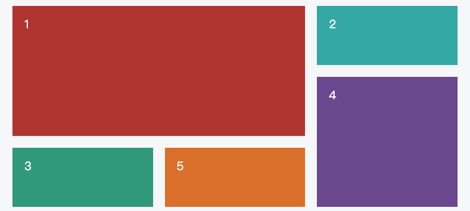

**Grid 布局的特点**：
- **二维布局**：同时控制行和列，适合复杂布局
- **精确控制**：可以精确指定项目的位置和大小
- **响应式友好**：配合 `auto-fit`、`minmax()` 等函数实现响应式布局
- **灵活对齐**：提供丰富的对齐选项

**Grid 与 Flexbox 的区别**：

| 特性 | Flexbox | Grid |
|------|---------|------|
| **维度** | 一维布局（行或列） | 二维布局（行和列） |
| **适用场景** | 组件内部排列 | 页面整体布局 |
| **控制方式** | 基于轴线 | 基于网格线/区域 |
| **对齐能力** | 单方向对齐 | 双向对齐 |

**选择建议**：
- **使用 Flexbox**：导航栏、工具栏、表单行、组件内部布局
- **使用 Grid**：页面整体布局、卡片网格、复杂二维布局
- **组合使用**：Grid 作为外层布局，Flexbox 处理内部元素排列

## 基本概念
学习 Grid 布局之前，需要了解一些基本概念。

### 容器和项目
采用网格布局的区域，称为"容器"（container）。容器内部采用网格定位的子元素，称为"项目"（item）。
``` html
<div>
  <div><p>1</p></div>
  <div><p>2</p></div>
  <div><p>3</p></div>
</div>
```
上面代码中，最外层的div元素就是容器，内层的三个div元素就是项目。

注意：项目只能是容器的顶层子元素，不包含项目的子元素，比如上面代码的p元素就不是项目。Grid 布局只对项目生效。

### 行和列
容器里面的水平区域称为"行"（row），垂直区域称为"列"（column）。

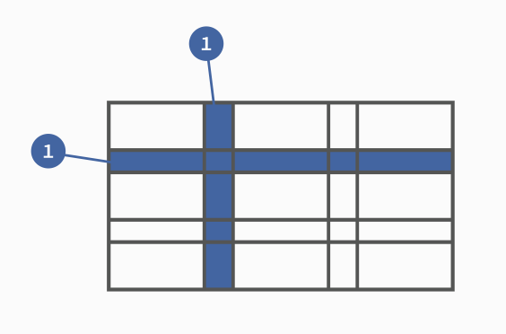


上图中，水平的深色区域就是"行"，垂直的深色区域就是"列"。

### 单元格
行和列的交叉区域，称为"单元格"（cell）。

正常情况下，n行和m列会产生n x m个单元格。比如，3行3列会产生9个单元格。

### 网格线
划分网格的线，称为"网格线"（grid line）。水平网格线划分出行，垂直网格线划分出列。

正常情况下，n行有n + 1根水平网格线，m列有m + 1根垂直网格线，比如三行就有四根水平网格线。

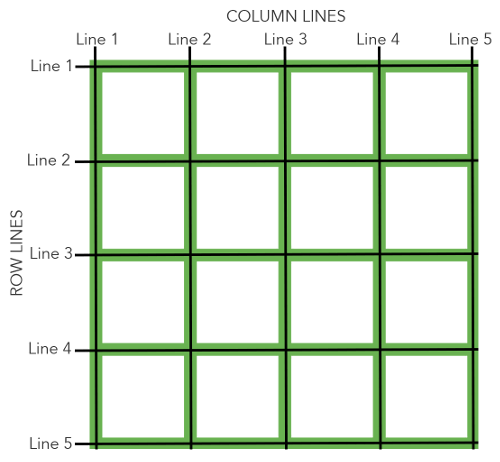

上图是一个 4 x 4 的网格，共有5根水平网格线和5根垂直网格线。

## 容器属性
Grid 布局的属性分成两类。一类定义在容器上面，称为容器属性；另一类定义在项目上面，称为项目属性。这部分先介绍容器属性。

### display 属性
display: grid指定一个容器采用网格布局。

```js
div {
  display: grid;
}
```
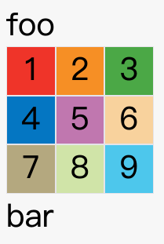

上图是display: grid的效果。

ps:添加display: grid属性后，本身不会对元素产生影响

默认情况下，容器元素都是块级元素，但也可以设成行内元素。

```js
div {
  display: inline-grid;
}
```
上面代码指定div是一个行内元素，该元素内部采用网格布局。


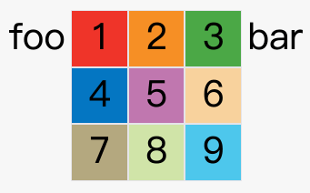

上图是display: inline-grid的效果。

注意，设为网格布局以后，容器子元素（项目）的float、display: inline-block、display: table-cell、vertical-align和column-*等设置都将失效。
## grid-template-rows 
- grid-template-rows属性定义每一行的行高。每一行的行高都一致的话，就要和列宽的数量一致

## grid-template-columns 
容器指定了网格布局以后，接着就要划分行和列。

- grid-template-columns属性定义每一列的列宽，想要有几列，就设置几个属性值


```js
.container {
  display: grid;
  grid-template-columns: 100px 100px 100px;
  grid-template-rows: 100px 100px 100px;
}
```
上面代码指定了一个三行三列的网格，列宽和行高都是100px。


除了使用绝对单位，也可以使用百分比。

```js
.container {
  display: grid;
  grid-template-columns: 33.33% 33.33% 33.33%;
  grid-template-rows: 33.33% 33.33% 33.33%;
}
```
#### repeat()

有时候，重复写同样的值非常麻烦，尤其网格很多时。这时，可以使用repeat()函数，简化重复的值。上面的代码用repeat()改写如下。

```js
.container {
  display: grid;
  grid-template-columns: repeat(3, 33.33%);
  grid-template-rows: repeat(3, 33.33%);
}
```
repeat()接受两个参数，第一个参数是重复的次数（上例是3），第二个参数是所要重复的值。

repeat()重复某种模式也是可以的。


grid-template-columns: repeat(2, 100px 20px 80px);
上面代码定义了6列，第一列和第四列的宽度为100px，第二列和第五列为20px，第三列和第六列为80px。

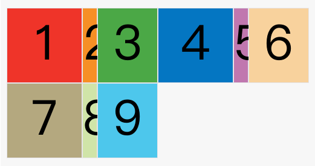
#### auto-fit 关键字
auto-fit 是用于 repeat() 函数的关键词，它会让网格容器自动调整列数以适应容器宽度。

#### auto-fill 关键字

有时，单元格的大小是固定的，但是容器的大小不确定。如果希望每一行（或每一列）容纳尽可能多的单元格，这时可以使用auto-fill关键字表示自动填充。

```js
.container {
  display: grid;
  grid-template-columns: repeat(auto-fill, 100px);
}
```
上面代码表示每列宽度100px，然后自动填充，直到容器不能放置更多的列。

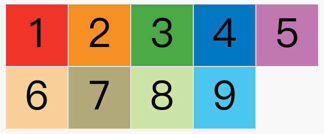

关键区别：
- auto-fit：拉伸列宽填满容器
- auto-fill：保持最小宽度，可能留白
#### fr 关键字

为了方便表示比例关系，网格布局提供了fr关键字（fraction 的缩写，意为"片段"）。如果两列的宽度分别为1fr和2fr，就表示后者是前者的两倍。

```js
.container {
  display: grid;
  grid-template-columns: 1fr 1fr;
}
```
上面代码表示两个相同宽度的列。

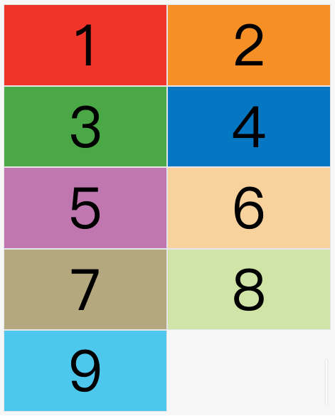


fr可以与绝对长度的单位结合使用，这时会非常方便。

```js
.container {
  display: grid;
  grid-template-columns: 150px 1fr 2fr;
}
```
上面代码表示，第一列的宽度为150像素，第二列的宽度是第三列的一半。

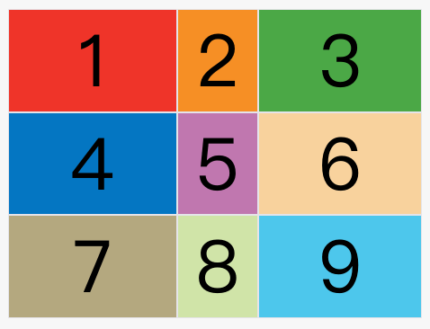


#### minmax()

minmax()函数产生一个长度范围，表示长度就在这个范围之中。它接受两个参数，分别为最小值和最大值。


grid-template-columns: 1fr 1fr minmax(100px, 1fr);
上面代码中，minmax(100px, 1fr)表示列宽不小于100px，不大于1fr。

#### auto 关键字

auto关键字表示由浏览器自己决定长度。


grid-template-columns: 100px auto 100px;
上面代码中，第二列的宽度，基本上等于该列单元格的最大宽度，除非单元格内容设置了min-width，且这个值大于最大宽度。

#### 网格线的名称

grid-template-columns属性和grid-template-rows属性里面，还可以使用方括号，指定每一根网格线的名字，方便以后的引用。

```js
.container {
  display: grid;
  grid-template-columns: [c1] 100px [c2] 100px [c3] auto [c4];
  grid-template-rows: [r1] 100px [r2] 100px [r3] auto [r4];
}
```
上面代码指定网格布局为3行 x 3列，因此有4根垂直网格线和4根水平网格线。方括号里面依次是这八根线的名字。

网格布局允许同一根线有多个名字，比如[fifth-line row-5]。

#### 布局实例

grid-template-columns属性对于网页布局非常有用。两栏式布局只需要一行代码。

```js
.wrapper {
  display: grid;
  grid-template-columns: 70% 30%;
}
```
上面代码将左边栏设为70%，右边栏设为30%。

传统的十二网格布局，写起来也很容易。


grid-template-columns: repeat(12, 1fr);
## row-gap ，column-gap ，gap 
- row-gap属性设置行与行的间隔（行间距）
- column-gap属性设置列与列的间隔（列间距）

```js
.container {
  row-gap: 20px;
  column-gap: 20px;
}
```
上面代码中，row-gap用于设置行间距，column-gap用于设置列间距。

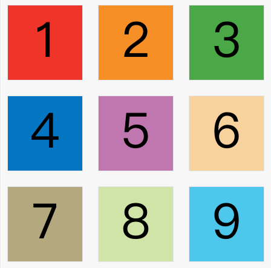

gap属性是column-gap和row-gap的合并简写形式，语法如下。

```js
gap: row-gap column-gap;
```
因此，上面一段 CSS 代码等同于下面的代码。

```js
.container {
  gap: 20px 20px;
}
```
如果gap省略了第二个值，浏览器认为第二个值等于第一个值。

## grid-template-areas 属性
网格布局允许指定"区域"（area），一个区域由单个或多个单元格组成。grid-template-areas属性用于定义区域。

```js
.container {
  display: grid;
  grid-template-columns: 100px 100px 100px;
  grid-template-rows: 100px 100px 100px;
  grid-template-areas: 'a b c'
                       'd e f'
                       'g h i';
}
```
上面代码先划分出9个单元格，然后将其定名为a到i的九个区域，分别对应这九个单元格。

多个单元格合并成一个区域的写法如下。


grid-template-areas: 'a a a'
                     'b b b'
                     'c c c';
上面代码将9个单元格分成a、b、c三个区域。

下面是一个布局实例。


grid-template-areas: "header header header"
                     "main main sidebar"
                     "footer footer footer";
上面代码中，顶部是页眉区域header，底部是页脚区域footer，中间部分则为main和sidebar。

如果某些区域不需要利用，则使用"点"（.）表示。


grid-template-areas: 'a . c'
                     'd . f'
                     'g . i';
上面代码中，中间一列为点，表示没有用到该单元格，或者该单元格不属于任何区域。

注意，区域的命名会影响到网格线。每个区域的起始网格线，会自动命名为区域名-start，终止网格线自动命名为区域名-end。

比如，区域名为header，则起始位置的水平网格线和垂直网格线叫做header-start，终止位置的水平网格线和垂直网格线叫做header-end。
## grid-auto-flow 属性
划分网格以后，容器的子元素会按照顺序，自动放置在每一个网格。默认的放置顺序是"先行后列"，即先填满第一行，再开始放入第二行，即下图数字的顺序。

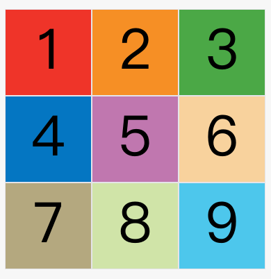


这个顺序由grid-auto-flow属性决定，默认值是row，即"先行后列"。也可以将它设成column，变成"先列后行"。


grid-auto-flow: column;
上面代码设置了column以后，放置顺序就变成了下图。


grid-auto-flow属性除了设置成row和column，还可以设成row dense和column dense。这两个值主要用于，某些项目指定位置以后，剩下的项目怎么自动放置。

下面的例子让1号项目和2号项目各占据两个单元格，然后在默认的grid-auto-flow: row情况下，会产生下面这样的布局。

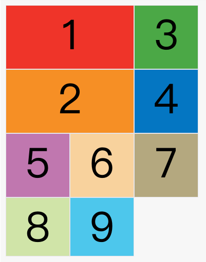


上图中，1号项目后面的位置是空的，这是因为3号项目默认跟着2号项目，所以会排在2号项目后面。

现在修改设置，设为row dense，表示"先行后列"，并且尽可能紧密填满，尽量不出现空格。


grid-auto-flow: row dense;
上面代码的效果如下。


上图会先填满第一行，再填满第二行，所以3号项目就会紧跟在1号项目的后面。8号项目和9号项目就会排到第四行。

如果将设置改为column dense，表示"先列后行"，并且尽量填满空格。


grid-auto-flow: column dense;
上面代码的效果如下。

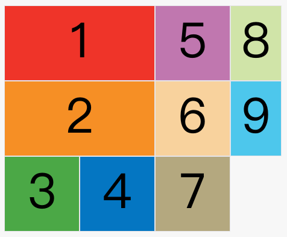


上图会先填满第一列，再填满第2列，所以3号项目在第一列，4号项目在第二列。8号项目和9号项目被挤到了第四列。

## justify-items ，align-items ，place-items 
justify-items属性设置单元格内容的水平位置（左中右），align-items属性设置单元格内容的垂直位置（上中下）。

```js
.container {
  justify-items: start | end | center | stretch;
  align-items: start | end | center | stretch;
}
```
这两个属性的写法完全相同，都可以取下面这些值。

start：对齐单元格的起始边缘。
end：对齐单元格的结束边缘。
center：单元格内部居中。
stretch：拉伸，占满单元格的整个宽度（默认值）。
```js
.container {
  justify-items: start;
}
```
上面代码表示，单元格的内容左对齐，效果如下图。

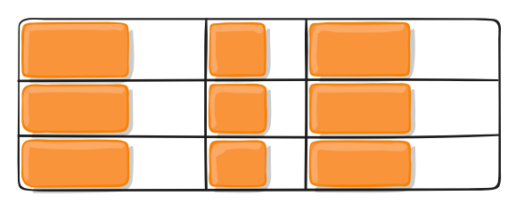


```js
.container {
  align-items: start;
}
```
上面代码表示，单元格的内容头部对齐，效果如下图。

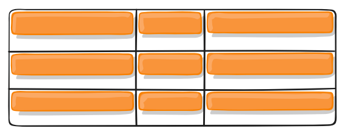


place-items属性是align-items属性和justify-items属性的合并简写形式。


place-items: align-items justify-items;
下面是一个例子。


place-items: start end;
如果省略第二个值，则浏览器认为与第一个值相等。

## justify-content ，align-content ，place-content，justify-content 属性，
align-content 属性，
place-content 属性
justify-content属性是整个内容区域在容器里面的水平位置（左中右），align-content属性是整个内容区域的垂直位置（上中下）。

```js
.container {
  justify-content: start | end | center | stretch | space-around | space-between | space-evenly;
  align-content: start | end | center | stretch | space-around | space-between | space-evenly;  
}
```
这两个属性的写法完全相同，都可以取下面这些值。 ntent属性的图完全一样，只是将水平方向改成垂直方向。）

start - 对齐容器的起始边框。
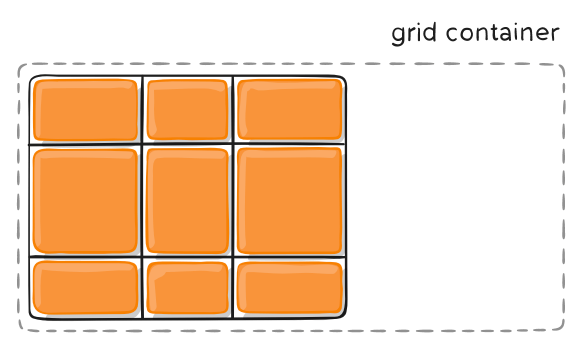


end - 对齐容器的结束边框。

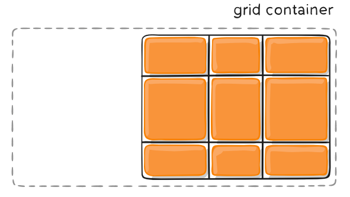

center - 容器内部居中。

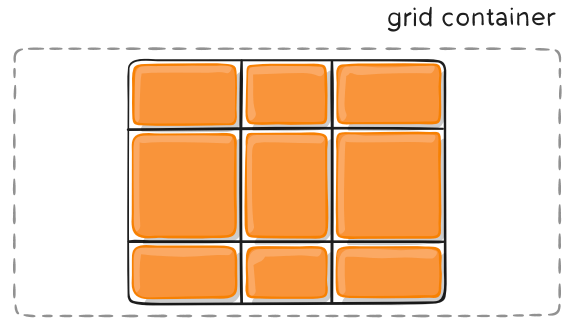

stretch - 项目大小没有指定时，拉伸占据整个网格容器。

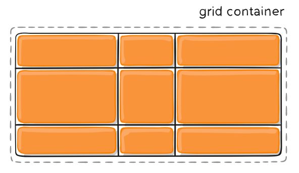

space-around - 每个项目两侧的间隔相等。所以，项目之间的间隔比项目与容器边框的间隔大一倍。
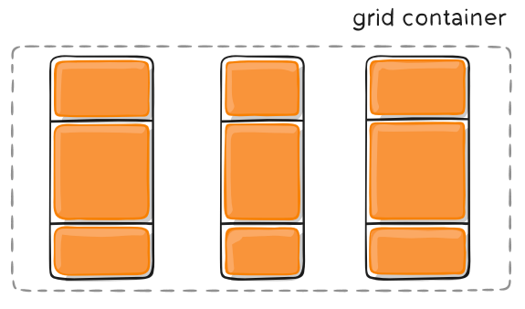


space-between - 项目与项目的间隔相等，项目与容器边框之间没有间隔。
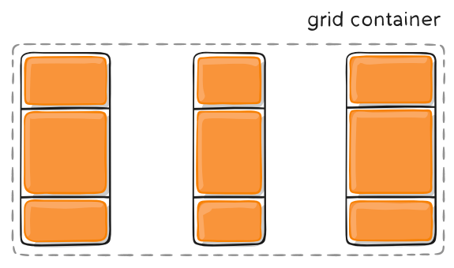


space-evenly - 项目与项目的间隔相等，项目与容器边框之间也是同样长度的间隔。
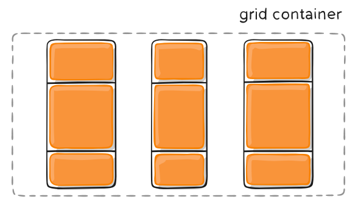


place-content属性是align-content属性和justify-content属性的合并简写形式。


place-content: align-content justify-content
下面是一个例子。


place-content: space-around space-evenly;
如果省略第二个值，浏览器就会假定第二个值等于第一个值。

## grid-auto-columns 属性，grid-auto-rows 属性
有时候，一些项目的指定位置，在现有网格的外部。比如网格只有3列，但是某一个项目指定在第5行。这时，浏览器会自动生成多余的网格，以便放置项目。

grid-auto-columns属性和grid-auto-rows属性用来设置，浏览器自动创建的多余网格的列宽和行高。它们的写法与grid-template-columns和grid-template-rows完全相同。如果不指定这两个属性，浏览器完全根据单元格内容的大小，决定新增网格的列宽和行高。

下面的例子里面，划分好的网格是3行 x 3列，但是，8号项目指定在第4行，9号项目指定在第5行。

```js
.container {
  display: grid;
  grid-template-columns: 100px 100px 100px;
  grid-template-rows: 100px 100px 100px;
  grid-auto-rows: 50px; 
}
```
上面代码指定新增的行高统一为50px（原始的行高为100px）。

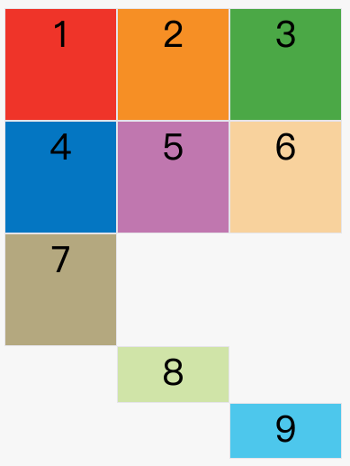


## grid-template 属性，grid 属性,grid-template属性是grid-template-columns、grid-template-rows和grid-template-areas这三个属性的合并简写形式。

grid属性是grid-template-rows、grid-template-columns、grid-template-areas、 grid-auto-rows、grid-auto-columns、grid-auto-flow这六个属性的合并简写形式。

从易读易写的角度考虑，还是建议不要合并属性，所以这里就不详细介绍这两个属性了。

## 五、现代 Grid 特性

### 5.1 子网格（Subgrid）

Subgrid 是 CSS Grid 的一个强大特性，允许网格项目继承父网格的轨道定义，创建嵌套网格布局。

**工作原理**：
- 子网格项目使用 `display: grid` 和 `grid-template-columns: subgrid`（或 `grid-template-rows: subgrid`）
- 子网格会继承父网格的列（或行）定义
- 子网格的项目会自动对齐到父网格的网格线

**示例代码**：

```css
.parent-grid {
  display: grid;
  grid-template-columns: repeat(3, 1fr);
  gap: 20px;
}

.child-item {
  display: grid;
  /* 继承父网格的列定义 */
  grid-template-columns: subgrid;
  grid-column: span 2; /* 跨越2列 */
  
  /* 子网格内部的行定义 */
  grid-template-rows: auto 1fr auto;
}

.child-item > * {
  /* 子网格项目自动对齐到父网格线 */
}
```

**应用场景**：
- 复杂嵌套布局
- 需要对齐多个网格项目
- 卡片内部需要与外部网格对齐

**浏览器兼容性**：
- Firefox 71+（需要 `-moz-` 前缀）
- Safari 16+（需要 `-webkit-` 前缀）
- Chrome/Edge：实验性支持（需要开启标志）
- **注意**：目前浏览器支持有限，建议谨慎使用或提供降级方案

### 5.2 瀑布流布局（Masonry Layout）

Masonry 布局是一种类似砖墙的布局方式，项目按照列排列，但每列的高度可以不同。

**Grid 中的 Masonry**：

```css
.container {
  display: grid;
  grid-template-columns: repeat(4, 1fr);
  grid-template-rows: masonry; /* 瀑布流布局 */
  gap: 20px;
}
```

**浏览器兼容性**：
- 目前只有 Firefox 支持（需要开启标志）
- **注意**：这是实验性特性，不建议在生产环境使用

**替代方案**：
- 使用 JavaScript 库（如 Masonry.js）
- 使用 CSS 多列布局（`column-count`）
- 使用 Flexbox 配合 JavaScript

## 六、项目属性
下面这些属性定义在项目上面。

### 6.1 grid-column-start / grid-column-end / grid-row-start / grid-row-end
项目的位置是可以指定的，具体方法就是指定项目的四个边框，分别定位在哪根网格线。

grid-column-start属性：左边框所在的垂直网格线
grid-column-end属性：右边框所在的垂直网格线
grid-row-start属性：上边框所在的水平网格线
grid-row-end属性：下边框所在的水平网格线

.item-1 {
  grid-column-start: 2;
  grid-column-end: 4;
}
上面代码指定，1号项目的左边框是第二根垂直网格线，右边框是第四根垂直网格线。

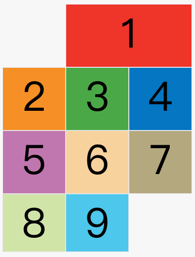


上图中，只指定了1号项目的左右边框，没有指定上下边框，所以会采用默认位置，即上边框是第一根水平网格线，下边框是第二根水平网格线。

除了1号项目以外，其他项目都没有指定位置，由浏览器自动布局，这时它们的位置由容器的grid-auto-flow属性决定，这个属性的默认值是row，因此会"先行后列"进行排列。读者可以把这个属性的值分别改成column、row dense和column dense，看看其他项目的位置发生了怎样的变化。

下面的例子是指定四个边框位置的效果。

```css
.item-1 {
  grid-column-start: 1;
  grid-column-end: 3;
  grid-row-start: 2;
  grid-row-end: 4;
}
```
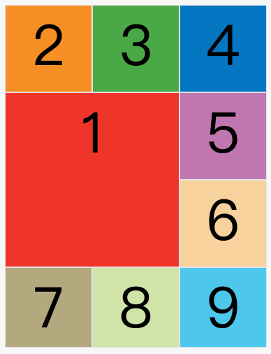


这四个属性的值，除了指定为第几个网格线，还可以指定为网格线的名字。


.item-1 {
  grid-column-start: header-start;
  grid-column-end: header-end;
}
上面代码中，左边框和右边框的位置，都指定为网格线的名字。

这四个属性的值还可以使用span关键字，表示"跨越"，即左右边框（上下边框）之间跨越多少个网格。


.item-1 {
  grid-column-start: span 2;
}
上面代码表示，1号项目的左边框距离右边框跨越2个网格。

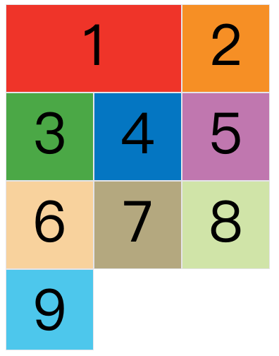


这与下面的代码效果完全一样。


.item-1 {
  grid-column-end: span 2;
}
使用这四个属性，如果产生了项目的重叠，则使用z-index属性指定项目的重叠顺序。

### 6.2 grid-column / grid-row
grid-column属性是grid-column-start和grid-column-end的合并简写形式，grid-row属性是grid-row-start属性和grid-row-end的合并简写形式。

```js
.item {
  grid-column: <start-line> / <end-line>;
  grid-row: <start-line> / <end-line>;
}
```
下面是一个例子。

```js
.item-1 {
  grid-column: 1 / 3;
  grid-row: 1 / 2;
}
/* 等同于 */
.item-1 {
  grid-column-start: 1;
  grid-column-end: 3;
  grid-row-start: 1;
  grid-row-end: 2;
}
```
上面代码中，项目item-1占据第一行，从第一根列线到第三根列线。

这两个属性之中，也可以使用span关键字，表示跨越多少个网格。

```js
.item-1 {
  background: #b03532;
  grid-column: 1 / 3;
  grid-row: 1 / 3;
}
/* 等同于 */
.item-1 {
  background: #b03532;
  grid-column: 1 / span 2;
  grid-row: 1 / span 2;
}
```
上面代码中，项目item-1占据的区域，包括第一行 + 第二行、第一列 + 第二列。

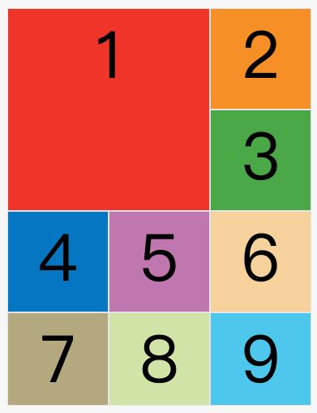


斜杠以及后面的部分可以省略，默认跨越一个网格。

```js
.item-1 {
  grid-column: 1;
  grid-row: 1;
}
```
上面代码中，项目item-1占据左上角第一个网格。

### 6.3 grid-area
grid-area属性指定项目放在哪一个区域。


.item-1 {
  grid-area: e;
}
上面代码中，1号项目位于e区域，效果如下图。

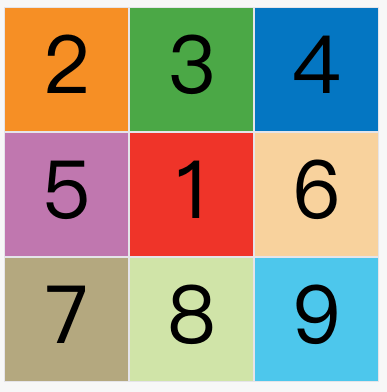


grid-area属性还可用作grid-row-start、grid-column-start、grid-row-end、grid-column-end的合并简写形式，直接指定项目的位置。

```js
.item {
  grid-area: <row-start> / <column-start> / <row-end> / <column-end>;
}
```
下面是一个例子。


.item-1 {
  grid-area: 1 / 1 / 3 / 3;
}
### 6.4 justify-self / align-self / place-self
justify-self属性设置单元格内容的水平位置（左中右），跟justify-items属性的用法完全一致，但只作用于单个项目。

align-self属性设置单元格内容的垂直位置（上中下），跟align-items属性的用法完全一致，也是只作用于单个项目。


.item {
  justify-self: start | end | center | stretch;
  align-self: start | end | center | stretch;
}
这两个属性都可以取下面四个值。

start：对齐单元格的起始边缘。
end：对齐单元格的结束边缘。
center：单元格内部居中。
stretch：拉伸，占满单元格的整个宽度（默认值）。
下面是justify-self: start的例子。


.item-1  {
  justify-self: start;
}

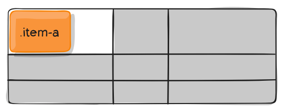

place-self属性是align-self属性和justify-self属性的合并简写形式。


place-self: align-self justify-self;
下面是一个例子。


place-self: center center;
如果省略第二个值，place-self属性会认为这两个值相等。

## 七、浏览器兼容性

### 7.1 基本支持

CSS Grid 在现代浏览器中有良好的支持：

- **Chrome**：57+（标准语法）
- **Firefox**：52+（标准语法）
- **Safari**：10.1+（标准语法）
- **Edge**：16+（标准语法）
- **IE**：10-11（旧语法，部分支持，不推荐使用）

### 7.2 新特性支持

- **Subgrid**：Firefox 71+、Safari 16+（实验性）
- **Masonry**：仅 Firefox（实验性，需开启标志）

### 7.3 最佳实践

1. **使用 Autoprefixer**：自动处理浏览器兼容性
2. **渐进增强**：为不支持 Grid 的浏览器提供 Flexbox 降级方案
3. **特性检测**：使用 `@supports` 规则进行特性检测

```css
/* 特性检测示例 */
@supports (display: grid) {
  .container {
    display: grid;
    grid-template-columns: repeat(3, 1fr);
  }
}

@supports not (display: grid) {
  .container {
    display: flex;
    flex-wrap: wrap;
  }
}
```

## 八、实用技巧与最佳实践

### 8.1 响应式网格

```css
/* 自动适应容器宽度 */
.responsive-grid {
  display: grid;
  grid-template-columns: repeat(auto-fit, minmax(250px, 1fr));
  gap: 20px;
}

/* 移动端单列，桌面端多列 */
@media (max-width: 768px) {
  .responsive-grid {
    grid-template-columns: 1fr;
  }
}
```

### 8.2 12 列网格系统

```css
.twelve-column {
  display: grid;
  grid-template-columns: repeat(12, 1fr);
  gap: 20px;
}

.col-1 { grid-column: span 1; }
.col-2 { grid-column: span 2; }
.col-3 { grid-column: span 3; }
.col-4 { grid-column: span 4; }
.col-6 { grid-column: span 6; }
.col-12 { grid-column: span 12; }
```

### 8.3 性能优化

- 避免过度嵌套 Grid
- 使用 `contain: layout` 优化渲染性能
- 合理使用 `will-change` 提示浏览器

```css
.grid-container {
  contain: layout;
  will-change: grid-template-columns; /* 仅在需要时使用 */
}
```

