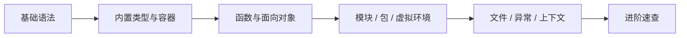

# Python 学习笔记

> 官方文档：<https://docs.python.org/zh-cn/3/>  
> 本模块按「**能写 → 能读 → 能查**」整理，方便日后快速回顾。

## 知识地图（建议学习顺序）



| 阶段 | 文档 | 核心能力 |
| --- | --- | --- |
| 入门 | [基础语法](./1_基础语法.md) | 变量、运算符、分支循环、缩进与注释 |
| 日常 | [内置类型与容器](./2_内置类型与容器.md) | `str` / `list` / `dict` / `set` / `tuple` |
| 组织代码 | [函数与面向对象](./3_函数与面向对象.md) | 函数、类、`self`、继承、魔术方法 |
| 工程化 | [模块包与虚拟环境](./4_模块包与虚拟环境.md) | `import`、`pip`、`venv`、项目结构 |
| 实战 | [文件异常与上下文](./5_文件异常与上下文.md) | 读写文件、`try/except`、`with` |
| 查阅 | [进阶速查](./6_进阶速查.md) | 推导式、装饰器、生成器、类型注解 |

## 与前端习惯的快速对照

| 概念 | JavaScript / TS | Python |
| --- | --- | --- |
| 块级作用域 | `{}` | **缩进**（通常 4 空格） |
| 相等 | `===` | `==`（值） / `is`（同一对象） |
| 假值 | `false, 0, '', null, undefined, NaN` | `False, 0, '', None, [], {}` 等 |
| 解构 | `const {a} = obj` | `a, b = (1, 2)` / 字典 `.items()` |
| 包管理 | `npm` / `pnpm` | `pip` + `venv` |
| 异步 | `async/await` | `async def` / `await`（进阶再学） |

## 环境速查

```bash
# 查看版本
python3 --version

# 创建并启用虚拟环境（项目根目录）
python3 -m venv .venv
source .venv/bin/activate   # macOS / Linux
# .venv\Scripts\activate    # Windows

# 安装依赖
pip install 包名
pip install -r requirements.txt

# 退出虚拟环境
deactivate
```

## 文档维护说明

- 每学完一章，可在对应文档末尾加 **「自己的坑 / 笔记」** 小节。
- 遇到第三方库（如 `requests`、`pandas`）可另开子文档，链到本目录即可。
