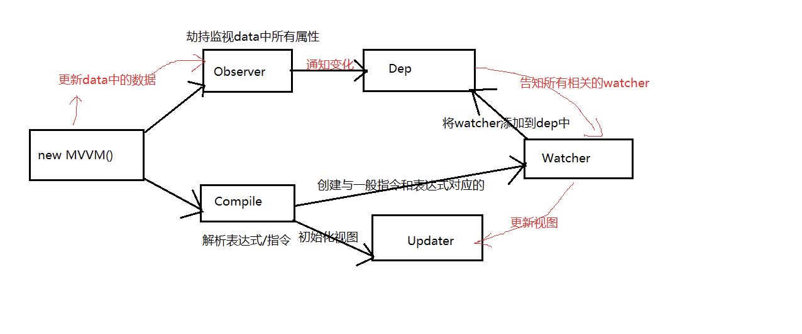

# Vue2
## Vue.js是什么?
  * <span style="color: orange;">**尤大大**</span>开发的前端js库
  * 借鉴angular的声明式开发, 指令, 表达式语法, 但语法也要简洁很多, 体积也小很多
  * 借鉴react的组件化开发, 更适用于更大型应用的开发
  * 它本身不是全能框架, 只关注UI, 如果需要router/ajax, 可以使用对应插件或使用别的库来实现
## 基本使用
* 引入vue.js
	* 创建Vue对象, 指定选项对象
		* el: 指定dom标签容器的选择器
		* data: 指定初始化状态属性数据的对象/函数(返回一个对象)
	* 页面中
		* 使用v-model: 实现双向数据绑定
		* 使用{{}}: 显示数据
* Vue对象的选项
	* el
		* 指定dom标签容器的选择器
		* Vue就会管理对应的标签及其子标签
	* data
		* 指定初始化状态属性数据的对象
		* vue对象可以直接访问其属性
		* 页面中可以直接访问使用
	* methods
		* 包含多个方法的对象
		* 供页面中的事件指令来绑定回调
		* 回调函数默认有event参数, 但也可以指定自己的参数
		* 所有的方法由vue对象来调用, 访问data中的属性直接使用this.xxx
	* computed
		* 包含多个方法的对象
		* 对状态属性进行计算返回一个新的数据, 供页面获取显示
		* 一般情况下是相当于是一个只读的属性
		* 利用set/get方法来实现属性数据的计算读取, 同时监视属性数据的变化
      * get：获取当前属性值，当读取当前属性值时回调
      * set：监视当前属性值的变化，当属性值变化时，调用函数
## computed
``` js
    computed: {
      fullName: {
        // getter
        get: function () {
          return this.firstName + ' ' + this.lastName
        },
        // setter
        set: function (newValue) {
          var names = newValue.split(' ')
          this.firstName = names[0]
          this.lastName = names[names.length - 1]
        }
      }
    }
```
## watch
* watch
  * 包含多个属性监视的对象
  * 分为一般监视和深度监视
  ``` js
  <div id="app">
      <input type="text" v-model:value="childrens.name" />
      <input type="text" v-model:value="lastName" />
  </div>
  
  <script type="text/javascript"> 
      var vm = new Vue( {
          el: '#app',
          data: {
              childrens: {
                  name: '小强',
                  age: 20,
                  sex: '男'
              },
              tdArray:["1","2"],
              lastName:"张三"
          },
          watch:{
              childrens:{
                  handler:function(val,oldval){
                      console.log(val.name)
                  },
                  deep:true//对象内部的属性监听，也叫深度监听
              },
              'childrens.name':function(val,oldval){
                  console.log(val+"aaa")
              },//键路径必须加上引号
              lastName:function(val,oldval){
                  console.log(this.lastName)
              }
          },//以V-model绑定数据时使用的数据变化监测
      } );
      vm.$watch("lastName",function(val,oldval){
          console.log(val)
      })//主动调用$watch方法来进行数据监测
  </script>
  ```
实例化 监视对象 ：两种方式 初始化 都不触发，
若想触发 **immediate: true** 即可
==这是高亮==
``` js
 this.$watch('form', function (newVal, oldVal) {
                    // 更改数据
                    console.log("form 改变了")
                    //this.isSaveForm = true
                }, {
                    deep: true
                })

正常监视对象： 
   watch:{
            form : {
                handler(val, oldval) {
                    console.log("监视数据")
                    if(this.flagHandler ){
                        console.log("写逻辑的地方")
                        this.isSaveForm = true
                    }
                },
               deep: true ,//对象内部的属性监听，也叫深度监听,
                // immediate: true
            },
        }
```
``` js
监视路由
// $route 需要用单引号'引起来
watch: {
  '$route' (to, from) {
    console.log(to)
  }
}

```
* 扩展数组
	* $remove(item) : 删除数组中对应的元素
	* $set(index, ele) : 给数组中指定下标指定对应的元素
	* vue重写了数组的方法, 实现对数组的操作的监视

## 页面指令
	* v-text/v-html: 指定标签体
		* v-text : 当作纯文本
		* v-html : 将value作为html标签来解析
	* v-if v-else v-show
		* v-if : 如果vlaue为true, 当前标签会输出在页面中
		* v-else : 与v-if一起使用, 如果value为false, 将当前标签输出到页面中
		* v-show: 就会在标签中添加display样式, 如果vlaue为true, display=block, 否则是none
	* v-for : 遍历
		* 遍历数组 : v-for="person in persons"   $index
		* 遍历对象 : v-for="value in person"   $key
	* v-on : 绑定事件监视
		* v-on:事件名, 可以缩写为: @事件名
		* 监视具体的按键: @ekeyup.keyCod   @keyup.enter
		* 阻止事件的冒泡和事件默认行为: @click.stop   @click.prevent
		* 隐含对象: $event
	* v-bind : 强制绑定解析表达式  
		* 很多属性值是不支持表达式的, 就可以使用v-bind
		* 可以缩写为:  :id='nanme'
  * 动态绑定class
    * :class="a"  a是一个data属性 ，a的值是指向的类名
    * :class="{ 'class-a': isA, 'class-b': isB }"   其中isA/isB是布尔型data属性，class-a是类名
    * :class="[‘classA’， ‘classB’]" 其中classA/classB是字符串值，不加引号就是变量名，e所以需要加引号
  * 动态绑定style
  ```js
  :style="{ color: activeColor, fontSize: fontSize + 'px'"  
  其中activeColor/fontSize是data属性，color/fontSize是样式名--使用驼峰命名法
  ```
  * 动态绑定style 三目形式
  ```js
  :style="{ 'backgroundImage': activeTransitionIndex == index ? `url(${item.bigPath})` : `url(${item.path})`  }"
  ```
* v-model
* 双向数据绑定
	* v-el : 标识某个标签
		* v-el:xxx
		* 读取得到标签对象: this.$els.xxx
## 过滤器
  * 内置
    * capitalize : 首字母大小
    * uppercase : 全部大写
    * lowercase : 全部小写
    * currency : 货币化
    * pluralize : 单数/复数处理
    * json : json格式化
    * limitBy : 限定数组的部分元素(下标)
    * filterBy : 限定数组的部分元素(值)
    * orderBy : 对数组进行排序


## 过渡动画
  * 利用vue去操控css的transition/animation动画
  * 模板: 使用transition包含带动画的标签
  * css样式
    * .fade-enter: 进入的开始状态(不可见), 在此指定进入前不可见的样式
    * .fade-enter-active: 进入的结束状态(可见), 在此指定显示的transition
    * .fade-leave-active: 离开的结束状态(不可见),在此指定隐藏的transition和消失后不可见的样式
    * .fade-leave: 离开的开始状态(可见) ---一般不用
  * 编码例子
    ``` js
    .xxx-enter-active, .xxx-leave-active {
    transition: opacity .5s
    }
    .xxx-enter, .xxx-leave-active {
    opacity: 0
    }

    <transition name="xxx">
    <p v-if="show">hello</p>
    </transition>
    ```
    

## 组件的生命周期
  * 主要的生命周期函数(钩子)
      * created(): 启动异步任务(发送ajax请求, 启动定时器，绑定自定义事件)
      * beforeDestroy(): 做一些收尾的工作  
      * beforeCreate：在new一个vue实例后，只有一些默认的生命周期钩子和默认事件，其他的东西都还没创建。在beforeCreate生命周期执行的时候，data和methods中的数据都还没有初始化。不能在这个阶段使用data中的数据和methods中的方法
      * create：data 和 methods都已经被初始化好了，如果要调用 methods 中的方法，或者操作 data 中的数据，最早可以在这个阶段中操作
      * beforeMount：执行到这个钩子的时候，在内存中已经编译好了模板了，但是还没有挂载到页面中，此时，页面还是旧的mounted：执行到这个钩子的时候，就表示Vue实例已经初始化完成了。此时组件脱离了创建阶段，进入到了运行阶段。 如果我们想要通过插件操作页面上的DOM节点，最早可以在和这个阶段中进行
      * beforeUpdate： 当执行这个钩子时，页面中的显示的数据还是旧的，data中的数据是更新后的， 页面还没有和最新的数据保持同步updated：页面显示的数据和data中的数据已经保持同步了，都是最新的
      * beforeDestory：Vue实例从运行阶段进入到了销毁阶段，这个时候上所有的 data 和 methods ， 指令， 过滤器 ……都是处于可用状态。还没有真正被销毁destroyed： 这个时候上所有的 data 和 methods ， 指令， 过滤器 ……都是处于不可用状态。组件已经被销毁了。
### created和mounted的区别
  * created:在模板渲染成html前调用，即通常初始化某些属性值，然后再渲染成视图。mounted:在模板渲染成html后调用，通常是初始化页面完成后，再对html的dom节点进行一些需要的操作。
### vue获取数据在哪个周期函数
    * 一般 created/beforeMount/mounted 皆可.比如如果你要操作 DOM , 那肯定 mounted 时候才能操作.
### 对vue生命周期的详细理解？
    * 共分为8个阶段创建前/后，载入前/后，更新前/后，销毁前/后。
        * 创建前/后： 在beforeCreated阶段，vue实例的挂载元素el和数据对象data都为undefined，还未初始化。
        * 在created阶段，vue实例的数据对象data有了，el还没有。
        * 载入前/后：在beforeMount阶段，vue实例的$el和data都初始化了，但还是挂载之前为虚拟的dom节点，data.message还未替换。
        * 在mounted阶段，vue实例挂载完成，data.message成功渲染。
        * 更新前/后：当data变化时，会触发beforeUpdate和updated方法。销毁前/后：在执行destroy方法后，对data的改变不会再触发周期函数，说明此时vue实例已经解除了事件监听以及和dom的绑定，但是dom结构依然存在。
### Vue 的父组件和子组件生命周期钩子函数执行顺序可以归类为以下 4 部分：
加载渲染过程
父 beforeCreate -> 父 created -> 父 beforeMount -> 子 beforeCreate -> 子 created -> 子 beforeMount -> 子 mounted -> 父 mounted
子组件更新过程
父 beforeUpdate -> 子 beforeUpdate -> 子 updated -> 父 updated
父组件更新过程
父 beforeUpdate -> 父 updated
销毁过程
父 beforeDestroy -> 子 beforeDestroy -> 子 destroyed -> 父 destroyed

* 关于标签名与标签属性名书写问题:
  * 标签名与标签属性名不区分大小写
  * 标签名: 如果组件名是XxxYyy, 标签名必须为xxx-yyy
  * 属性名: 如果标签属性名为xxx-yyy, 组件得到的属性名为: xxxYyy
* 使用props传递数据
  * 组件标签: 
``` js
  <my-component name='tom' :age='myAge' :set-name='setName'></my-component>
```
* 1.指定名称
``` js
   props:["name","age","setName"];
```
* 方式二: 指定名称和类型
``` js
props: {
  name: String,
  age: Number,
  setNmae: Function
}
```
* 方式三: 指定名称/类型/必要性/默认值
``` js
props: {
  name: {type: String, required: true, default:xxx},
}
```
## 组件间通信
* 父子 props/event parent/children ref provide/inject 
* 兄弟 bus vuex 
* 跨级 bus vuex provide.inject

  * 尽量通过props的方式实现组件间通信
  * 自定义事件：绑定和触发

  * 基本原则: 不要在子组件中直接修改父组件的状态数据
  * 可以使用vue的自定义事件机制实现组件间通信
    * 绑定事件监听

 * 方式一: 通过$on()
  ``` js
          vm.$on('delete_todo', function (todo) {
            this.deleteTodo(todo)
          })
  ```
 方式二: 通过events选项
``` js     
        events: {
          'delete_todo': function (todo) {
            this.deleteTodo(todo)
          }
        }
```
方式三: 通过v-on绑定
``` js 
        @delete_todo="deleteTodo"
```
  * 触发事件(3种情况)
      this.$emit(eventName, data): 在当前组件触发事件
## router
### $route 和 router 的区别
  * router是VueRouter的实例，在script标签中想要导航到不同的URL,使用router.push方法。返回上一个历史history用router.to(-1)$route为当前router跳转对象。里面可以获取当前路由的name,path,query,parmas等。
### vue-router
- 路由两种模式
    - hash
      - 特点
          - hash 路径带 #，# 后面的值（路由路径）不会提交到 server 端；
          - hash 可以改变 url ，准确来说改变的是 # 后面的值，页面不会刷新；
          - 兼容性更好, IE6+。
      - 原理
          - hash 通过 window.location.hash 的方式，实现路由跳转的功能。
          - hash 通过 window.onhashchange 的方式，来监听 hash 的改变，借此实现无刷新跳转的功能。
  - history
      - 特点
        - history 路径不带 #，更美观。
        - history 可以改变 url ，改变的是整个 url，页面不会刷新；
        - 兼容性稍差, IE10+；
        - 页面刷新时，history 可能会出现 404 问题。
      - 原理
        - history 通过 window.history.pushState / replaceState 等方式，实现路由跳转的功能。
        - history 通过 window.onpopstate 的方式，来监听 url 的改变，借此实现无刷新跳转的功能。
## vue-router实现路由懒加载（ 动态加载路由 ）
  * 方式第一种：vue异步组件技术 ==== 异步加载，vue-router配置路由 , 使用vue的异步组件技术 , 可以实现按需加载 .但是,这种情况下一个组件生成一个js文件。
  * 第二种：路由懒加载(使用import)。
  * 第三种：webpack提供的require.ensure()，vue-router配置路由，使用webpack的require.ensure技术，也可以实现按需加载。这种情况下，多个路由指定相同的chunkName，会合并打包成一个js文件。


## vue-router插件使用

* 相关API说明
  * VueRouter(): 用于创建路由器的构建函数
    ``` js
    new VueRouter({
      // 多个配置项
    })
    ```
  * 路由配置
    ``` js
    routes: [
      { // 一般路由
        path: '/about',
        component: about
      },
      { // 自动跳转路由
        path: '/', 
        redirect: '/about'
      }
    ]
    ```
  * 组件:
    * router-link: 用来生成路由链接
      ```
      <router-link to="/xxx">Go to XXX</router-link>
      ```
    * router-view: 用来显示当前路由组件界面
      ```
      <router-view></router-view>
      ```
      
### 实现简单路由
  * 路由组件:
    * home.vue
    * about.vue
  * 应用组件: App.vue
    ```js
    <div>
      <!--路由链接-->
      <router-link to="/about">About</router-link>
      <router-link to="/home">Home</router-link>
      <!--用于渲染当前路由组件-->
      <router-view></router-view>  
    </div>
    ```
  * 入口js: main.js
    ```js
    // 创建路由器(配置路由)
    new VueRouter({
      routes: [
        {
          path: '/',
          redirect: '/about'
        },
        {
          path: '/about',
          component: about
        },
        {
          path: '/home',
          component: home
        }
      ]
    })
      
    // 创建vue配置路由器
    new Vue({
      el: '#app',
      router,
      render: h => h(app)
    })
    ```
  * 优化路由器配置
    ```js
    linkActiveClass: 'active', // 指定选中的路由链接的class
    mode: 'history',  // 路由路径不带#   --
原理：这种模式充分利用了history.pushState API来完成URL的跳转而不需要重新加载页面。
    ```
    
### 嵌套路由
  * 配置嵌套路由
    ```js
    path: '/home',
    component: home,
    children: [
      {
        path: 'news',
        component: news
      },
      {
        path: 'message',
        component: message
      }
    ]
    ```
  * 路由路径
    ```js
    <router-link to="/home/news">News</router-link>
    <router-link to="/home/message">Message</router-link>
    ```
* 向路由组件传递数据
  * 路由路径携带参数
    * 配置路由
      ```js
      children: [
        {
          path: 'mdetail/:id',
          component: messageDetail
        }
      ]
      ```
    * 路由路径
      ```js
      <router-link :to="'/home/message/mdetail/'+m.id">{{m.title}}</router-link>
      ```
    * 路由组件中读取请求参数
      ```js
      this.$route.params.id
      ```
  * router-view属性携带数据
    ```js
    <router-view :msg="msg"></router-view>
    ```
* 其它重要
  * 使用keep-alive缓存路由组件
    ```js
    <keep-alive>
      <router-view></router-view>
    </keep-alive>
    ```


## vuex
vuex的核心概念--四个对象
1. state
   vuex管理的状态对象
   它应该是唯一的
```js
const state = {
      xxx: initValue
   }
```
组件获取vuex中state值的方式
* 第一种
```js
this.$store.state.state中值得名称
```
* 第二种
在组件引入mapState函数
```js
import {mapState} from 'vuex'
//当前组件需要得全局数据，映射成计算属性
computed:{
        ...mapState(['state中值得名称'])
}
```
 2. mutations
   * 包含多个直接更新state的方法(回调函数)的对象
   * 谁来触发: action中的commit('mutation名称')--写在actions中
   * 只能包含同步的代码, 不能写异步代码
  ```js
  const mutations = {
      // 其中data 是 组件传递得参数
      yyy (state, data) { 
         // 更新state的某个属性
      }
      // 可以接收参数
      ADDCOUNT(state,step){
          state.count += step
      }
        
   }
   // 组件中调用 this.$store.commit('yyy',data)
  ```
组件触发vuex中mutations的方式
* 第一种
```js
this.$store.commit('yyy',data)
```
* 第二种
在组件引入mapMutations函数
```js
import {mapMutations} from 'vuex'
//当前组件需要得mutations函数，映射成method中得方法
method:{
    // 方法可以直接在template中直接使用
        ...mapMutations(['mutations中方法得名称1','mutations中方法得名称2']),
            
    }


<template>
  <div>
      <button @click="mutations中方法得名称1(3)">按钮-</button>

  </div>
</template>
```
3. actions
   * 包含多个事件回调函数的对象
   * 通过调用mutation的回调函数, 间接更新state,不能直接修改state的数据
   * 谁来触发: 组件中: $store.dispatch('action名称')  // 'zzz'--写在store文件中
   * 可以包含异步代码(定时器, ajax)
  ```js
  const actions = {
      // data1是传递的参数
      zzz ({commit, state}, data1) {
         commit('yyy', data2)
      }
   }
   // 组件中调用 this.$store.dispatch('zzz',data1)
  ```
* 第一种方式
this.$store.dispatch('zzz',data1)
*  第二种
在组件引入mapActions函数
```js
import {mapActions} from 'vuex'
//当前组件需要得mapActions函数，映射成method中得方法
method:{
      // 方法可以直接在template中直接使用
        ...mapActions(['actions中方法得名称1','actionss中方法得名称2']),
    }
```
 4. getters
   * 包含多个计算属性(get)的对象
   * 谁来读取: 组件中: $store.getters.xxx
  ```js
  const getters = {
      mmm (state) {
         return ...
      }
   }
  ``` 
1. modules
   * 包含多个module
   * 一个module是一个store的配置对象
   * 与一个组件(包含有共享数据)对应


6. 向外暴露store对象--在store文件中，固定写法
  ```js
  export default new Vuex.Store({
      state,
      mutations,
      actions,
      getters
   })
  ``` 

### 组件中:
```js
 import {mapGetters, mapActions} from 'vuex'
   export default {
      computed: mapGetters(['mmm'])
      methods: mapActions(['zzz'])
   }

   {{mmm}} @click="zzz(data)"
```
### 映射store --在主文件中
```js
   import store from './store'
   new Vue({
      store
   })


 将vuex引到项目中
下载: npm install vuex --save
## 2. 使用vuex
   store.js
   import Vuex from 'vuex'
      export default new Vuex.Store({
         state,
         mutations,
         actions,
         getters,
         modules
      })
main.js
    import store from './store.js'
      new Vue({
         store
      })

```
## Vue.user 原理
  * Vue.use() 是 Vue.js 框架提供的一个全局方法，用于安装插件。Vue 插件可以为Vue增加全局功能，比如路由管理（Vue Router）、状态管理（Vuex）等。以下是 Vue.use() 方法的工作原理概览：

  * 注册插件: 当调用 Vue.use(plugin) 时，Vue 会检查给定的 plugin 是否是一个对象并且具有 install 方法。这是Vue插件的标准定义方式，要求插件作者提供一个接受 Vue 构造器作为参数的 install 函数。
  * 安装插件: 如果插件符合要求，Vue 会调用这个 install 方法，并将Vue构造器作为参数传入。在这个方法内部，插件可以执行各种初始化操作，比如添加全局方法、指令、混入、组件等，从而扩展Vue的功能。
  * 确保唯一安装: Vue 内部会跟踪已安装的插件，如果尝试多次调用 Vue.use() 安装同一个插件，它只会执行一次安装过程。这意味着插件的安装逻辑是幂等的，可以放心调用而不用担心重复执行。
  * 传递选项: Vue.use() 方法还可以接受一个可选的第二个参数，这个参数会被传递给插件的 install 方法，使得插件可以在安装时根据这些选项进行定制化配置。
```js
// 假设有一个名为 MyPlugin 的插件
const MyPlugin = {
  install(Vue, options) {
    // 在这里可以添加全局方法、指令、过滤器等
    Vue.prototype.$myMethod = function() {
      console.log('MyPlugin method called', options);
    };
  }
};

// 使用插件
Vue.use(MyPlugin, { customOption: 'value' });

// 现在Vue实例可以访问$myMethod了
new Vue().$myMethod(); // 输出: "MyPlugin method called { customOption: 'value' }"
```

## nextTick
重要API : nextTick : 在下次 DOM 更新循环结束之后执行延迟回调。在修改数据之后立即使用这个方法，获取更新后的 DOM。

调用方法：Vue.set( target, key, value )

target：要更改的数据源(可以是对象或者数组)

key：要更改的具体数据

value ：重新赋的值

* 创建一个全局的方法：
  * this.$root.$on('methodName',(param) => {})
调用：
  * this.$root.$emit('methodName',param)
## 响应式数据原理



* 总结：
初始化：当我们new MVVM时，会创建两个对象，observer对象和compile对象，
observer对象：通过递归的方式劫持监视所有属性，并为每一个属性添加了Dep对象，dep中有一个属性subs是数组，存放的是watcher，
compile对象：调用updater初始化视图，为一般指令和表达式创建对应的watcher，将watcher添加到对应的dep中。
更新时：更新data中数据时，调用observer中的set(),然后通知dep，再通知所有关联的watcher，watcher中又一个cb回调，
指向的是updater函数，然后更新页面
## vue 性能优化
* 编码优化
* 不要将所有的数据都放在data中，数据都会被劫持，data中的数据都会增加getter和setter，会收集对应的 watcher，这样就会降低性能。所以将数据尽可能扁平化，如果数据只是用来渲染可以使用Object.freeze，可以将数据冻结起来
vue 在 v-for 时给每项元素绑定事件需要用事件代理，节约性能。key 保证唯一性，不要使用索引 ( vue 中diff算法会采用就地复用策略)
* 单页面采用keep-alive缓存组件。
* 尽可能拆分组件，来提高复用性、增加代码的可维护性，减少不必要的渲染。因为组件粒度最细，改组件的数组，它只会渲染当前的组件。
* v-if 当值为false时内部指令不会执行，具有阻断功能，很多情况下使用v-if替代v-show，合理使用if和show。
* 合理使用路由懒加载、异步组件。
* 尽量采用runtime运行时版本。
* 数据持久化的问题，使用防抖、节流进行优化，尽可能的少执行和不执行。
* 静态资源：图片懒加载，可以为页面添加一个滚动条事件，判断图片是否在可视区域内或者即将进入可视区域，优先加载。
* 图片预加载
* CDN
* CSS Sprite、SVG sprite、 Icon font、Base64
* 缩略图
* 缓存利用
* gzip压缩
* 使用事件委托
* html:减少DOM嵌套
* css:减少重绘重排，降低 CSS 选择器的复杂性
* js：延迟脚本 defer async
* 浏览器缓存策略，
* 强缓存，也称本地缓存；以及弱缓存，也就是协商缓存。添加 Expires 或 * max-age
## Diff 算法原理
一、虚拟DOM
什么是虚拟DOM？
虚拟DOM就是把真实DOM树的结构和信息抽象出来，以对象的形式模拟树形结构，如下：


2. 为什么要使用 Virtual DOM

MVVM 框架解决视图和状态同步问题
模板引擎可以简化视图操作，没办法跟踪状态
虚拟DOM跟踪状态变化

virtual-dom的动机描述 -- 参考 github上的 virtual-dom

虚拟DOM可以维护程序的状态，跟踪上一次的状态
通过比较前后两次状态差异更新真实DOM

3. 虚拟DOM的作用

维护视图和状态的关系
复杂视图情况下提升渲染性能
跨平台

浏览器平台渲染DOM
服务端渲染 SSR (Nuxt.js/Next.js)
原生应用(Weex/React Native)
小程序(mpvue/uni-app)等

二、 Diff算法传统Diff算法
遍历两棵树中的每一个节点，每两个节点之间都要做一次比较。
比如 a->e 、a->d 、a->b、a->c、a->a
遍历完成的时间复杂度达到了O(n^2)
对比完差异后还要计算最小转换方式，实现后复杂度来到了O(n^3)

Vue优化的Diff算法

Vue的diff算法只会比较同层级的元素，不进行跨层级比较

三、 Vue中的Diff算法实现Vnode分类
EmptyVNode: 没有内容的注释节点
TextVNode: 文本节点
ElementVNode: 普通元素节点
ComponentVNode: 组件节点
CloneVNode: 克隆节点，可以是以上任意类型的节点，唯一的区别在于isCloned属性为true
Patch函数
patch函数接收以下参数：
oldVnode：旧的虚拟节点
Vnode：新的虚拟节点
hydrating：是否要和真实DOM混合
removeOnly：特殊的flag，用于 transition-group
处理流程大致分为以下步骤：
vnode不存在，oldVnode存在时，移除oldVnode
vnode存在，oldVnode不存在时，创建vnode
vnode和oldVnode都存在时
如果vnode和oldVnode是同一个节点（通过sameVnode函数对比 后续详解），通过patchVnode进行后续比对工作
如果vnode和oldVnode不是同一个节点，那么根据vnode创建新的元素并挂载至oldVnode父元素下。如果组件根节点被替换，遍历更新父节点element。然后移除旧节点。如果oldVnode是服务端渲染元素节点，需要用hydrate函数将虚拟dom和真是dom进行映射
源码如下，已写好注释便于阅读
```js
return function patch(oldVnode, vnode, hydrating, removeOnly) {
    // 如果vnode不存在，但是oldVnode存在，移除oldVnode
    if (isUndef(vnode)) {
      if (isDef(oldVnode)) invokeDestroyHook(oldVnode)
      return
    }

    let isInitialPatch = false
    const insertedVnodeQueue = []

    // 如果oldVnode不存在，但是vnode存在时，创建vnode
    if (isUndef(oldVnode)) {
      isInitialPatch = true
      createElm(vnode, insertedVnodeQueue)
    } else {
      // 剩余情况为vnode和oldVnode都存在

      // 判断是否为真实DOM元素
      const isRealElement = isDef(oldVnode.nodeType)
      if (!isRealElement && sameVnode(oldVnode, vnode)) {
        // 如果vnode和oldVnode是同一个（通过sameVnode函数进行比对  后续详解）
        // 受用patchVnode函数进行后续比对工作 （函数后续详解）
        patchVnode(oldVnode, vnode, insertedVnodeQueue, removeOnly)
      } else {
        // vnode和oldVnode不是同一个的情况
        if (isRealElement) {
          // 如果存在真实的节点，存在data-server-render属性
          if (oldVnode.nodeType === 1 && oldVnode.hasAttribute(SSR_ATTR)) {
            // 当旧的Vnode是服务端渲染元素，hydrating记为true
            oldVnode.removeAttribute(SSR_ATTR)
            hydrating = true
          }
          // 需要用hydrate函数将虚拟DOM和真实DOM进行映射
          if (isTrue(hydrating)) {
            // 需要合并到真实DOM上
            if (hydrate(oldVnode, vnode, insertedVnodeQueue)) {
              // 调用insert钩子
              invokeInsertHook(vnode, insertedVnodeQueue, true)
              return oldVnode
            } else if (process.env.NODE_ENV !== 'production') {
              warn(
                'The client-side rendered virtual DOM tree is not matching ' +
                'server-rendered content. This is likely caused by incorrect ' +
                'HTML markup, for example nesting block-level elements inside ' +
                '<p>, or missing <tbody>. Bailing hydration and performing ' +
                'full client-side render.'
              )
            }
          }
          // 如果不是服务端渲染元素或者合并到真实DOM失败，则创建一个空的Vnode节点去替换它
          oldVnode = emptyNodeAt(oldVnode)
        }

        // 获取oldVnode父节点
        const oldElm = oldVnode.elm
        const parentElm = nodeOps.parentNode(oldElm)

        // 根据vnode创建一个真实DOM节点并挂载至oldVnode的父节点下
        createElm(
          vnode,
          insertedVnodeQueue,
          oldElm._leaveCb ? null : parentElm,
          nodeOps.nextSibling(oldElm)
        )

        // 如果组件根节点被替换，遍历更新父节点Element
        if (isDef(vnode.parent)) {
          let ancestor = vnode.parent
          const patchable = isPatchable(vnode)
          while (ancestor) {
            for (let i = 0; i < cbs.destroy.length; ++i) {
              cbs.destroy[i](ancestor)
            }
            ancestor.elm = vnode.elm
            if (patchable) {
              for (let i = 0; i < cbs.create.length; ++i) {
                cbs.create[i](emptyNode, ancestor)
              }
              // #6513
              // invoke insert hooks that may have been merged by create hooks.
              // e.g. for directives that uses the "inserted" hook.
              const insert = ancestor.data.hook.insert
              if (insert.merged) {
                // start at index 1 to avoid re-invoking component mounted hook
                for (let i = 1; i < insert.fns.length; i++) {
                  insert.fns[i]()
                }
              }
            } else {
              registerRef(ancestor)
            }
            ancestor = ancestor.parent
          }
        }

        // 销毁旧节点
        if (isDef(parentElm)) {
          // 移除老节点
          removeVnodes(parentElm, [oldVnode], 0, 0)
        } else if (isDef(oldVnode.tag)) {
          // 调用destroy钩子
          invokeDestroyHook(oldVnode)
        }
      }
    }
    // 调用insert钩子并返回节点
    invokeInsertHook(vnode, insertedVnodeQueue, isInitialPatch)
    return vnode.elm
  }
```
sameVnode函数
Vue怎么判断是不是同一个节点？流程如下：
判断Key值是否一样
tag的值是否一样
isComment，这个不用太关注。
数据一样
sameInputType()，专门对表单输入项进行判断的：input一样但是里面的type不一样算不同的inputType
从这里可以看出key对diff算法的辅助作用，可以快速定位是否为同一个元素，必须保证唯一性。
如果你用的是index作为key，每次打乱顺序key都会改变，导致这种判断失效，降低了Diff的效率。
因此，用好key也是Vue性能优化的一种方式。
源码如下：
```js
function sameVnode(a, b) {
  return (
    a.key === b.key && (
      (
        a.tag === b.tag &&
        a.isComment === b.isComment &&
        isDef(a.data) === isDef(b.data) &&
        sameInputType(a, b)
      ) || (
        isTrue(a.isAsyncPlaceholder) &&
        a.asyncFactory === b.asyncFactory &&
        isUndef(b.asyncFactory.error)
      )
    )
  )
}
patchVnode函数
前置条件vnode和oldVnode是同一个节点
执行流程：
如果oldVnode和vnode引用一致，可以认为没有变化，return
如果oldVnode的isAsyncPlaceholder属性为true，跳过检查异步组件，return
如果oldVnode跟vnode都是静态节点，且具有相同的key，同时vnode是克隆节点或者v-once指令控制的节点时，只需要把oldVnode.elm和oldVnode.child都复制到vnode上，也不用再有其他操作，return
如果vnode不是文本节或注释节点
如果vnode和oldVnode都有子节点并且两者子节点不一致时，就调用updateChildren更新子节点
如果只有vnode有自子节点，则调用addVnodes创建子节点
如果只有oldVnode有子节点，则调用removeVnodes把这些子节点都删除
如果vnode文本为undefined，则清空vnode.elm文本
如果vnode是文本节点但是和oldVnode文本内容不同，只需更新文本。
源代码如下，已写好注释便于阅读
function patchVnode(oldVnode, vnode, insertedVnodeQueue, removeOnly) {

    // 如果新老节点引用一致，直接返回。
    if (oldVnode === vnode) {
      return
    }

    const elm = vnode.elm = oldVnode.elm

    // 如果oldVnode的isAsyncPlaceholder属性为true，跳过检查异步组件
    if (isTrue(oldVnode.isAsyncPlaceholder)) {
      if (isDef(vnode.asyncFactory.resolved)) {
        hydrate(oldVnode.elm, vnode, insertedVnodeQueue)
      } else {
        vnode.isAsyncPlaceholder = true
      }
      return
    }

    // 如果新旧都是静态节点，vnode的key也相同
    // 新vnode是克隆所得或新vnode有 v-once属性
    // 则进行赋值，然后返回。vnode的componentInstance 保持不变
    if (isTrue(vnode.isStatic) &&
      isTrue(oldVnode.isStatic) &&
      vnode.key === oldVnode.key &&
      (isTrue(vnode.isCloned) || isTrue(vnode.isOnce))
    ) {
      vnode.componentInstance = oldVnode.componentInstance
      return
    }

    let i
    const data = vnode.data
    // 执行data.hook.prepatch 钩子
    if (isDef(data) && isDef(i = data.hook) && isDef(i = i.prepatch)) {
      i(oldVnode, vnode)
    }

    // 获取子元素列表
    const oldCh = oldVnode.children
    const ch = vnode.children

    if (isDef(data) && isPatchable(vnode)) {
      // 遍历调用 cbs.update 钩子函数，更新oldVnode所有属性
      // 包括attrs、class、domProps、events、style、ref、directives
      for (i = 0; i < cbs.update.length; ++i) cbs.update[i](oldVnode, vnode)
      // 执行data.hook.update 钩子
      if (isDef(i = data.hook) && isDef(i = i.update)) i(oldVnode, vnode)
    }
    // Vnode 的 text选项为undefined
    if (isUndef(vnode.text)) {
      if (isDef(oldCh) && isDef(ch)) {
        //新老节点的children不同，执行updateChildren方法
        if (oldCh !== ch) updateChildren(elm, oldCh, ch, insertedVnodeQueue, removeOnly)
      } else if (isDef(ch)) {
        // oldVnode children不存在 执行 addVnodes方法
        if (isDef(oldVnode.text)) nodeOps.setTextContent(elm, '')
        addVnodes(elm, null, ch, 0, ch.length - 1, insertedVnodeQueue)
      } else if (isDef(oldCh)) {
        // vnode不存在执行removeVnodes方法
        removeVnodes(elm, oldCh, 0, oldCh.length - 1)
      } else if (isDef(oldVnode.text)) {
        // 新旧节点都是undefined，且老节点存在text，清空文本。
        nodeOps.setTextContent(elm, '')
      }
    } else if (oldVnode.text !== vnode.text) {
      // 新老节点文本内容不同，更新文本
      nodeOps.setTextContent(elm, vnode.text)
    }
    if (isDef(data)) {
      // 执行data.hook.postpatch钩子，至此 patch完成
      if (isDef(i = data.hook) && isDef(i = i.postpatch)) i(oldVnode, vnode)
    }
  }
```
updateChildren函数
重点！！！
前置条件：vnode和oldVnode的children不相等
整体的执行思路如下：
vnode头对比oldVnode头
vnode尾对比oldVnode尾
vnode头对比oldVnode尾
vnode尾对比oldVnode头
只要符合一种情况就进行patch，移动节点，移动下标等操作
都不对再在oldChild中找一个key和newStart相同的节点
找不到，新建一个。
找到，获取这个节点，判断它和newStartVnode是不是同一个节点
如果是相同节点，进行patch 然后将这个节点插入到oldStart之前，newStart下标继续移动
如果不是相同节点，需要执行createElm创建新元素
为什么会有头对尾、尾对头的操作？
可以快速检测出reverse操作，加快diff效率。
源码如下 已写好注释便于阅读：
```js
function updateChildren(parentElm, oldCh, newCh, insertedVnodeQueue, removeOnly) {

    // 定义变量
    let oldStartIdx = 0  // 老节点Child头下标
    let newStartIdx = 0  // 新节点Child头下标
    let oldEndIdx = oldCh.length - 1  // 老节点Child尾下标
    let oldStartVnode = oldCh[0]      // 老节点Child头结点
    let oldEndVnode = oldCh[oldEndIdx] // 老节点Child尾结点
    let newEndIdx = newCh.length - 1   // 新节点Child尾下标
    let newStartVnode = newCh[0]       // 新节点Child头结点
    let newEndVnode = newCh[newEndIdx]  // 新节点Child尾结点
    let oldKeyToIdx, idxInOld, vnodeToMove, refElm  

    // removeOnly is a special flag used only by <transition-group>
    // to ensure removed elements stay in correct relative positions
    // during leaving transitions
    const canMove = !removeOnly

    if (process.env.NODE_ENV !== 'production') {
      checkDuplicateKeys(newCh)
    }

    // 定义循环
    while (oldStartIdx <= oldEndIdx && newStartIdx <= newEndIdx) {
      // 存在检测
      if (isUndef(oldStartVnode)) {
        oldStartVnode = oldCh[++oldStartIdx] // Vnode has been moved left
      } else if (isUndef(oldEndVnode)) {
        oldEndVnode = oldCh[--oldEndIdx]

      // 如果老结点Child头和新节点Child头是同一个节点
      } else if (sameVnode(oldStartVnode, newStartVnode)) {
        // patch差异
        patchVnode(oldStartVnode, newStartVnode, insertedVnodeQueue)
        // patch完成  移动节点位置  继续比对下一个节点
        oldStartVnode = oldCh[++oldStartIdx]
        newStartVnode = newCh[++newStartIdx]

      // 如果老结点Child尾和新节点Child尾是同一个节点
      } else if (sameVnode(oldEndVnode, newEndVnode)) {
        // patch差异
        patchVnode(oldEndVnode, newEndVnode, insertedVnodeQueue)
        // patch完成  移动节点位置 继续比对下一个节点
        oldEndVnode = oldCh[--oldEndIdx]
        newEndVnode = newCh[--newEndIdx]

      // 如果老结点Child头和新节点Child尾是同一个节点
      } else if (sameVnode(oldStartVnode, newEndVnode)) { // Vnode moved right
         // patch差异
        patchVnode(oldStartVnode, newEndVnode, insertedVnodeQueue)
        // 把oldStart节点放到oldEnd节点后面
        canMove && nodeOps.insertBefore(parentElm, oldStartVnode.elm, nodeOps.nextSibling(oldEndVnode.elm))
        // patch完成  移动节点位置 继续比对下一个节点
        oldStartVnode = oldCh[++oldStartIdx]
        newEndVnode = newCh[--newEndIdx]
      // 如果老结点Child尾和新节点Child头是同一个节点
      } else if (sameVnode(oldEndVnode, newStartVnode)) { // Vnode moved left
         // patch差异
        patchVnode(oldEndVnode, newStartVnode, insertedVnodeQueue)
        // 把oldEnd节点放到oldStart节点前面
        canMove && nodeOps.insertBefore(parentElm, oldEndVnode.elm, oldStartVnode.elm)
        // patch完成  移动节点位置 继续比对下一个节点
        oldEndVnode = oldCh[--oldEndIdx]
        newStartVnode = newCh[++newStartIdx]
      } else {
        // 如果没有相同的Key，执行createElm方法创建元素
        if (isUndef(oldKeyToIdx)) oldKeyToIdx = createKeyToOldIdx(oldCh, oldStartIdx, oldEndIdx)
        idxInOld = isDef(newStartVnode.key) ?
          oldKeyToIdx[newStartVnode.key] :
          findIdxInOld(newStartVnode, oldCh, oldStartIdx, oldEndIdx)
        if (isUndef(idxInOld)) { // New element
          createElm(newStartVnode, insertedVnodeQueue, parentElm, oldStartVnode.elm, false, newCh, newStartIdx)
        } else {
          // 有相同的Key，判断这两个节点是否为sameNode
          vnodeToMove = oldCh[idxInOld]
          if (sameVnode(vnodeToMove, newStartVnode)) {
            // 如果是相同节点，进行patch  然后举将oldStart插入到oldStart之前，newStart下标继续移动
            patchVnode(vnodeToMove, newStartVnode, insertedVnodeQueue)
            oldCh[idxInOld] = undefined
            canMove && nodeOps.insertBefore(parentElm, vnodeToMove.elm, oldStartVnode.elm)
          } else {
            // 如果不是相同节点，需要执行createElm创建新元素
            createElm(newStartVnode, insertedVnodeQueue, parentElm, oldStartVnode.elm, false, newCh, newStartIdx)
          }
        }
        newStartVnode = newCh[++newStartIdx]
      }
    }

    // oldStartIdx > oldEndIdx说明oldChild先遍历完，使用addVnode方法添加newStartIdx指向的节点到newEndIdx的节点
    if (oldStartIdx > oldEndIdx) {
      refElm = isUndef(newCh[newEndIdx + 1]) ? null : newCh[newEndIdx + 1].elm
      addVnodes(parentElm, refElm, newCh, newStartIdx, newEndIdx, insertedVnodeQueue)
    } else if (newStartIdx > newEndIdx) {
      // 如果newStartIdx > newEndIdx说明newChild先遍历完，remove掉oldChild未遍历完的节点
      removeVnodes(parentElm, oldCh, oldStartIdx, oldEndIdx)
    }
  }
```
四、总结
正确使用key，可以快速执行sameVnode比对，加速Diff效率，可以作为性能优化的一个点。
DIff只做同级比较，使用sameVnode函数比对，文本节点直接替换文本内容。
子元素列表的Diff，进行头对头、尾对尾、头对尾等系列比较，直到遍历完两个元素的子元素列表。
或一个列表先遍历完了，直接addVnode / removeVnode。

Vue 2 的 Diff 算法特点：
全量比较：Vue 2 的diff算法倾向于对整个Virtual DOM树进行比较，这种方法在小型应用中表现尚可，但在处理大型应用或复杂界面时可能导致性能瓶颈，尤其是在数据变化频繁的场景下。
动态指令优化不足：Vue 2 中动态指令的diff算法在某些情况下不够高效，可能导致不必要的重渲染。
事件监听器重置：每次组件更新时，Vue 2 会重新设置事件监听器，这在组件频繁更新时会造成一定的性能损耗。
静态内容处理：Vue 2 没有特别区分静态内容（即页面上不变的部分），即使这部分内容实际上不需要更新，也会参与diff过程。
Vue 3 的 Diff 算法改进：
Incremental DOM Updates（增量DOM更新）：Vue 3 引入了更高效的增量更新策略，只对实际发生变化的部分进行更新，大幅度减少了DOM操作，提升了性能。
静态提升（Static Node Hoisting）：Vue 3 能够识别出不会改变的静态节点，并将其从diff过程中移除，进一步减少计算量。
源码缓存与动态节点追踪：Vue 3 对使用key的节点做了源码缓存，并更有效地追踪动态节点，使得在特定区间内的节点变化时，仅对这些节点应用最小化操作。
基于块的虚拟DOM表示：Vue 3 使用了更细粒度的更新策略，通过对DOM树进行分块处理，减少了遍历次数，降低了组件更新的开销。
改进的事件处理：Vue 3 优化了事件处理器的管理，减少了不必要的事件绑定和解绑操作，提升了性能。


