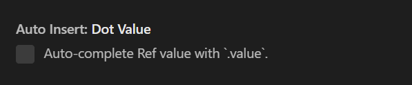
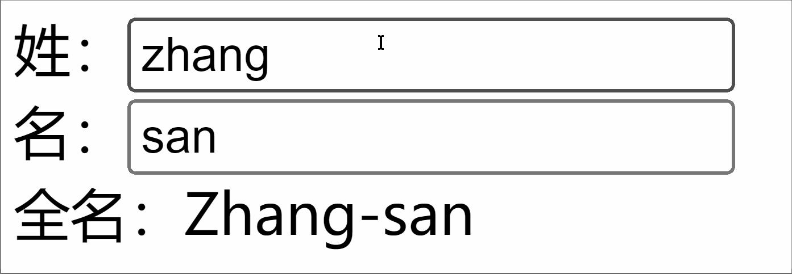

## 2. 【基于 vite 创建vue工程】(推荐)

`vite` 是新一代前端构建工具，官网地址：[https://vitejs.cn](https://vitejs.cn/)，`vite`的优势如下：

- 轻量快速的热重载（`HMR`），能实现极速的服务启动。
- 对 `TypeScript`、`JSX`、`CSS` 等支持开箱即用。
- 真正的按需编译，不再等待整个应用编译完成。
- `webpack`构建 与 `vite`构建对比图如下：
- 
- 
  <!--   -->

* 具体操作如下（点击查看[官方文档](https://cn.vuejs.org/guide/quick-start.html#creating-a-vue-application)）

```powershell
## 1.创建命令
npm create vue@latest

## 2.具体配置
## 配置项目名称
√ Project name: vue3_test
## 是否添加TypeScript支持
√ Add TypeScript?  Yes
## 是否添加JSX支持
√ Add JSX Support?  No
## 是否添加路由环境
√ Add Vue Router for Single Page Application development?  No
## 是否添加pinia环境
√ Add Pinia for state management?  No
## 是否添加单元测试
√ Add Vitest for Unit Testing?  No
## 是否添加端到端测试方案
√ Add an End-to-End Testing Solution? » No
## 是否添加ESLint语法检查
√ Add ESLint for code quality?  Yes
## 是否添加Prettiert代码格式化
√ Add Prettier for code formatting?  No
```

## 3.6. 【ref 对比 reactive】

宏观角度看：

> 1. `ref`用来定义：**基本类型数据**、**对象类型数据**；
>
> 2. `reactive`用来定义：**对象类型数据**。

- 区别：

> 1. `ref`创建的变量必须使用`.value`（可以使用`volar`插件自动添加`.value`）。
>
<!-- >     -->
>
> 2. `reactive`重新分配一个新对象，会**失去**响应式（可以使用`Object.assign`去整体替换）。

- 使用原则：
  > 1. 若需要一个基本类型的响应式数据，必须使用`ref`。
  > 2. 若需要一个响应式对象，层级不深，`ref`、`reactive`都可以。
  > 3. 若需要一个响应式对象，且层级较深，推荐使用`reactive`。

## 3.7. 【toRefs 与 toRef】

- 作用：将一个响应式对象中的每一个属性，转换为`ref`对象。
- 备注：`toRefs`与`toRef`功能一致，但`toRefs`可以批量转换。
- 语法如下：

```vue
<template>
  <div class="person">
    <h2>
      姓名：{{ person.name }}
    </h2>
    <h2>
      年龄：{{ person.age }}
    </h2>
    <h2>
      性别：{{
        person.gender
      }}
    </h2>
    <button
      @click="changeName"
    >
      修改名字
    </button>
    <button
      @click="changeAge"
    >
      修改年龄
    </button>
    <button
      @click="changeGender"
    >
      修改性别
    </button>
  </div>
</template>

<script
  lang="ts"
  setup
  name="Person"
>
import {
  ref,
  reactive,
  toRefs,
  toRef,
} from "vue";

// 数据
let person = reactive({
  name: "张三",
  age: 18,
  gender: "男",
});

// 通过toRefs将person对象中的n个属性批量取出，且依然保持响应式的能力
let { name, gender } =
  toRefs(person);

// 通过toRef将person对象中的gender属性取出，且依然保持响应式的能力
let age = toRef(
  person,
  "age"
);

// 方法
function changeName() {
  name.value += "~";
}
function changeAge() {
  age.value += 1;
}
function changeGender() {
  gender.value = "女";
}
</script>
```

## 3.8. 【computed】

作用：根据已有数据计算出新数据（和`Vue2`中的`computed`作用一致）。

<!--  -->

```vue
<template>
  <div class="person">
    姓：<input
      type="text"
      v-model="firstName"
    />
    <br />
    名：<input
      type="text"
      v-model="lastName"
    />
    <br />
    全名：<span>{{
      fullName
    }}</span>
    <br />
    <button
      @click="changeFullName"
    >
      全名改为：li-si
    </button>
  </div>
</template>

<script
  setup
  lang="ts"
  name="App"
>
import {
  ref,
  computed,
} from "vue";

let firstName = ref("zhang");
let lastName = ref("san");

// 计算属性——只读取，不修改
/* let fullName = computed(()=>{
    return firstName.value + '-' + lastName.value
  }) */

// 计算属性——既读取又修改
let fullName = computed({
  // 读取
  get() {
    return (
      firstName.value +
      "-" +
      lastName.value
    );
  },
  // 修改
  set(val) {
    console.log(
      "有人修改了fullName",
      val
    );
    firstName.value =
      val.split("-")[0];
    lastName.value =
      val.split("-")[1];
  },
});

function changeFullName() {
  fullName.value = "li-si";
}
</script>
```

## 3.9.【watch】

- 作用：监视数据的变化（和`Vue2`中的`watch`作用一致）
- 特点：`Vue3`中的`watch`只能监视以下**四种数据**：
  > 1. `ref`定义的数据。
  > 2. `reactive`定义的数据。
  > 3. 函数返回一个值（`getter`函数）。
  > 4. 一个包含上述内容的数组。

我们在`Vue3`中使用`watch`的时候，通常会遇到以下几种情况：

### \* 情况一

监视`ref`定义的【基本类型】数据：直接写数据名即可，监视的是其`value`值的改变。

```vue
<template>
  <div class="person">
    <h1>
      情况一：监视【ref】定义的【基本类型】数据
    </h1>
    <h2>
      当前求和为：{{ sum }}
    </h2>
    <button
      @click="changeSum"
    >
      点我sum+1
    </button>
  </div>
</template>

<script
  lang="ts"
  setup
  name="Person"
>
import {
  ref,
  watch,
} from "vue";
// 数据
let sum = ref(0);
// 方法
function changeSum() {
  sum.value += 1;
}
// 监视，情况一：监视【ref】定义的【基本类型】数据
const stopWatch = watch(
  sum,
  (newValue, oldValue) => {
    console.log(
      "sum变化了",
      newValue,
      oldValue
    );
    if (newValue >= 10) {
      stopWatch();
    }
  }
);
</script>
```

### \* 情况二

监视`ref`定义的【对象类型】数据：直接写数据名，监视的是对象的【地址值】，若想监视对象内部的数据，要手动开启深度监视。

> 注意：
>
> - 若修改的是`ref`定义的对象中的属性，`newValue` 和 `oldValue` 都是新值，因为它们是同一个对象。
>
> - 若修改整个`ref`定义的对象，`newValue` 是新值， `oldValue` 是旧值，因为不是同一个对象了。

```vue
<template>
  <div class="person">
    <h1>
      情况二：监视【ref】定义的【对象类型】数据
    </h1>
    <h2>
      姓名：{{ person.name }}
    </h2>
    <h2>
      年龄：{{ person.age }}
    </h2>
    <button
      @click="changeName"
    >
      修改名字
    </button>
    <button
      @click="changeAge"
    >
      修改年龄
    </button>
    <button
      @click="changePerson"
    >
      修改整个人
    </button>
  </div>
</template>

<script
  lang="ts"
  setup
  name="Person"
>
import {
  ref,
  watch,
} from "vue";
// 数据
let person = ref({
  name: "张三",
  age: 18,
});
// 方法
function changeName() {
  person.value.name += "~";
}
function changeAge() {
  person.value.age += 1;
}
function changePerson() {
  person.value = {
    name: "李四",
    age: 90,
  };
}
/* 
    监视，情况一：监视【ref】定义的【对象类型】数据，监视的是对象的地址值，若想监视对象内部属性的变化，需要手动开启深度监视
    watch的第一个参数是：被监视的数据
    watch的第二个参数是：监视的回调
    watch的第三个参数是：配置对象（deep、immediate等等.....） 
  */
watch(
  person,
  (newValue, oldValue) => {
    console.log(
      "person变化了",
      newValue,
      oldValue
    );
  },
  { deep: true }
);
</script>
```

### \* 情况三

监视`reactive`定义的【对象类型】数据，且默认开启了深度监视。

```vue
<template>
  <div class="person">
    <h1>
      情况三：监视【reactive】定义的【对象类型】数据
    </h1>
    <h2>
      姓名：{{ person.name }}
    </h2>
    <h2>
      年龄：{{ person.age }}
    </h2>
    <button
      @click="changeName"
    >
      修改名字
    </button>
    <button
      @click="changeAge"
    >
      修改年龄
    </button>
    <button
      @click="changePerson"
    >
      修改整个人
    </button>
    <hr />
    <h2>
      测试：{{ obj.a.b.c }}
    </h2>
    <button @click="test">
      修改obj.a.b.c
    </button>
  </div>
</template>

<script
  lang="ts"
  setup
  name="Person"
>
import {
  reactive,
  watch,
} from "vue";
// 数据
let person = reactive({
  name: "张三",
  age: 18,
});
let obj = reactive({
  a: {
    b: {
      c: 666,
    },
  },
});
// 方法
function changeName() {
  person.name += "~";
}
function changeAge() {
  person.age += 1;
}
function changePerson() {
  Object.assign(person, {
    name: "李四",
    age: 80,
  });
}
function test() {
  obj.a.b.c = 888;
}

// 监视，情况三：监视【reactive】定义的【对象类型】数据，且默认是开启深度监视的
watch(
  person,
  (newValue, oldValue) => {
    console.log(
      "person变化了",
      newValue,
      oldValue
    );
  }
);
watch(
  obj,
  (newValue, oldValue) => {
    console.log(
      "Obj变化了",
      newValue,
      oldValue
    );
  }
);
</script>
```

### \* 情况四

监视`ref`或`reactive`定义的【对象类型】数据中的**某个属性**，注意点如下：

1. 若该属性值**不是**【对象类型】，需要写成函数形式。
2. 若该属性值是**依然**是【对象类型】，可直接编，也可写成函数，建议写成函数。

结论：监视的要是对象里的属性，那么最好写函数式，注意点：若是对象监视的是地址值，需要关注对象内部，需要手动开启深度监视。

```vue
<template>
  <div class="person">
    <h1>
      情况四：监视【ref】或【reactive】定义的【对象类型】数据中的某个属性
    </h1>
    <h2>
      姓名：{{ person.name }}
    </h2>
    <h2>
      年龄：{{ person.age }}
    </h2>
    <h2>
      汽车：{{
        person.car.c1
      }}、{{ person.car.c2 }}
    </h2>
    <button
      @click="changeName"
    >
      修改名字
    </button>
    <button
      @click="changeAge"
    >
      修改年龄
    </button>
    <button @click="changeC1">
      修改第一台车
    </button>
    <button @click="changeC2">
      修改第二台车
    </button>
    <button
      @click="changeCar"
    >
      修改整个车
    </button>
  </div>
</template>

<script
  lang="ts"
  setup
  name="Person"
>
import {
  reactive,
  watch,
} from "vue";

// 数据
let person = reactive({
  name: "张三",
  age: 18,
  car: {
    c1: "奔驰",
    c2: "宝马",
  },
});
// 方法
function changeName() {
  person.name += "~";
}
function changeAge() {
  person.age += 1;
}
function changeC1() {
  person.car.c1 = "奥迪";
}
function changeC2() {
  person.car.c2 = "大众";
}
function changeCar() {
  person.car = {
    c1: "雅迪",
    c2: "爱玛",
  };
}

// 监视，情况四：监视响应式对象中的某个属性，且该属性是基本类型的，要写成函数式
/* watch(()=> person.name,(newValue,oldValue)=>{
    console.log('person.name变化了',newValue,oldValue)
  }) */

// 监视，情况四：监视响应式对象中的某个属性，且该属性是对象类型的，可以直接写，也能写函数，更推荐写函数
watch(
  () => person.car,
  (newValue, oldValue) => {
    console.log(
      "person.car变化了",
      newValue,
      oldValue
    );
  },
  { deep: true }
);
</script>
```

### \* 情况五

监视上述的多个数据

```vue
<template>
  <div class="person">
    <h1>
      情况五：监视上述的多个数据
    </h1>
    <h2>
      姓名：{{ person.name }}
    </h2>
    <h2>
      年龄：{{ person.age }}
    </h2>
    <h2>
      汽车：{{
        person.car.c1
      }}、{{ person.car.c2 }}
    </h2>
    <button
      @click="changeName"
    >
      修改名字
    </button>
    <button
      @click="changeAge"
    >
      修改年龄
    </button>
    <button @click="changeC1">
      修改第一台车
    </button>
    <button @click="changeC2">
      修改第二台车
    </button>
    <button
      @click="changeCar"
    >
      修改整个车
    </button>
  </div>
</template>

<script
  lang="ts"
  setup
  name="Person"
>
import {
  reactive,
  watch,
} from "vue";

// 数据
let person = reactive({
  name: "张三",
  age: 18,
  car: {
    c1: "奔驰",
    c2: "宝马",
  },
});
// 方法
function changeName() {
  person.name += "~";
}
function changeAge() {
  person.age += 1;
}
function changeC1() {
  person.car.c1 = "奥迪";
}
function changeC2() {
  person.car.c2 = "大众";
}
function changeCar() {
  person.car = {
    c1: "雅迪",
    c2: "爱玛",
  };
}

// 监视，情况五：监视上述的多个数据
watch(
  [
    () => person.name,
    person.car,
  ],
  (newValue, oldValue) => {
    console.log(
      "person.car变化了",
      newValue,
      oldValue
    );
  },
  { deep: true }
);
</script>
```

## 3.10. 【watchEffect】

- 官网：立即运行一个函数，同时响应式地追踪其依赖，并在依赖更改时重新执行该函数。

- `watch`对比`watchEffect`

  > 1. 都能监听响应式数据的变化，不同的是监听数据变化的方式不同
  >
  > 2. `watch`：要明确指出监视的数据
  >
  > 3. `watchEffect`：不用明确指出监视的数据（函数中用到哪些属性，那就监视哪些属性）。

- 示例代码：

  ```vue
  <template>
    <div class="person">
      <h1>
        需求：水温达到50℃，或水位达到20cm，则联系服务器
      </h1>
      <h2 id="demo">
        水温：{{ temp }}
      </h2>
      <h2>
        水位：{{ height }}
      </h2>
      <button
        @click="changePrice"
      >
        水温+1
      </button>
      <button
        @click="changeSum"
      >
        水位+10
      </button>
    </div>
  </template>

  <script
    lang="ts"
    setup
    name="Person"
  >
  import {
    ref,
    watch,
    watchEffect,
  } from "vue";
  // 数据
  let temp = ref(0);
  let height = ref(0);

  // 方法
  function changePrice() {
    temp.value += 10;
  }
  function changeSum() {
    height.value += 1;
  }

  // 用watch实现，需要明确的指出要监视：temp、height
  watch(
    [temp, height],
    (value) => {
      // 从value中获取最新的temp值、height值
      const [
        newTemp,
        newHeight,
      ] = value;
      // 室温达到50℃，或水位达到20cm，立刻联系服务器
      if (
        newTemp >= 50 ||
        newHeight >= 20
      ) {
        console.log(
          "联系服务器"
        );
      }
    }
  );

  // 用watchEffect实现，不用
  const stopWtach =
    watchEffect(() => {
      // 室温达到50℃，或水位达到20cm，立刻联系服务器
      if (
        temp.value >= 50 ||
        height.value >= 20
      ) {
        console.log(
          document.getElementById(
            "demo"
          )?.innerText
        );
        console.log(
          "联系服务器"
        );
      }
      // 水温达到100，或水位达到50，取消监视
      if (
        temp.value === 100 ||
        height.value === 50
      ) {
        console.log("清理了");
        stopWtach();
      }
    });
  </script>
  ```

## 3.11. 【标签的 ref 属性】

作用：用于注册模板引用。

> - 用在普通`DOM`标签上，获取的是`DOM`节点。
>
> - 用在组件标签上，获取的是组件实例对象。

用在普通`DOM`标签上：

```vue
<template>
  <div class="person">
    <h1 ref="title1">
      尚硅谷
    </h1>
    <h2 ref="title2">前端</h2>
    <h3 ref="title3">Vue</h3>
    <input
      type="text"
      ref="inpt"
    />
    <br /><br />
    <button @click="showLog">
      点我打印内容
    </button>
  </div>
</template>

<script
  lang="ts"
  setup
  name="Person"
>
import { ref } from "vue";

let title1 = ref();
let title2 = ref();
let title3 = ref();

function showLog() {
  // 通过id获取元素
  const t1 =
    document.getElementById(
      "title1"
    );
  // 打印内容
  console.log(
    (t1 as HTMLElement)
      .innerText
  );
  console.log(
    (<HTMLElement>t1)
      .innerText
  );
  console.log(t1?.innerText);

  /************************************/

  // 通过ref获取元素
  console.log(title1.value);
  console.log(title2.value);
  console.log(title3.value);
}
</script>
```

用在组件标签上：

```vue
<!-- 父组件App.vue -->
<template>
  <Person ref="ren" />
  <button @click="test">
    测试
  </button>
</template>

<script
  lang="ts"
  setup
  name="App"
>
import Person from "./components/Person.vue";
import { ref } from "vue";

let ren = ref();

function test() {
  console.log(ren.value.name);
  console.log(ren.value.age);
}
</script>

<!-- 子组件Person.vue中要使用defineExpose暴露内容 -->
<script
  lang="ts"
  setup
  name="Person"
>
import {
  ref,
  defineExpose,
} from "vue";
// 数据
let name = ref("张三");
let age = ref(18);
/****************************/
/****************************/
// 使用defineExpose将组件中的数据交给外部
defineExpose({ name, age });
</script>
```

## 3.12. 【props】

> ```js
> // 定义一个接口，限制每个Person对象的格式
> export interface PersonInter {
>   id: string;
>   name: string;
>   age: number;
> }
>
> // 定义一个自定义类型Persons
> export type Persons =
>   Array<PersonInter>;
> ```
>
> `App.vue`中代码：
>
> ```vue
> <template>
>   <Person :list="persons" />
> </template>
>
> <script
>   lang="ts"
>   setup
>   name="App"
> >
> import Person from "./components/Person.vue";
> import { reactive } from "vue";
> import { type Persons } from "./types";
>
> let persons =
>   reactive<Persons>([
>     {
>       id: "e98219e12",
>       name: "张三",
>       age: 18,
>     },
>     {
>       id: "e98219e13",
>       name: "李四",
>       age: 19,
>     },
>     {
>       id: "e98219e14",
>       name: "王五",
>       age: 20,
>     },
>   ]);
> </script>
> ```
>
> `Person.vue`中代码：
>
> ```Vue
> <template>
> <div class="person">
>  <ul>
>      <li v-for="item in list" :key="item.id">
>         {{item.name}}--{{item.age}}
>       </li>
>     </ul>
>    </div>
>    </template>
>
> <script lang="ts" setup name="Person">
> import {defineProps} from 'vue'
> import {type PersonInter} from '@/types'
>
>   // 第一种写法：仅接收
> // const props = defineProps(['list'])
>
>   // 第二种写法：接收+限制类型
> // defineProps<{list:Persons}>()
>
>   // 第三种写法：接收+限制类型+指定默认值+限制必要性
> let props = withDefaults(defineProps<{list?:Persons}>(),{
>      list:()=>[{id:'asdasg01',name:'小猪佩奇',age:18}]
>   })
>    console.log(props)
>   </script>
> ```

## 3.13. 【生命周期】

- 概念：`Vue`组件实例在创建时要经历一系列的初始化步骤，在此过程中`Vue`会在合适的时机，调用特定的函数，从而让开发者有机会在特定阶段运行自己的代码，这些特定的函数统称为：生命周期钩子

- 规律：

  > 生命周期整体分为四个阶段，分别是：**创建、挂载、更新、销毁**，每个阶段都有两个钩子，一前一后。

- `Vue2`的生命周期

  > 创建阶段：`beforeCreate`、`created`
  >
  > 挂载阶段：`beforeMount`、`mounted`
  >
  > 更新阶段：`beforeUpdate`、`updated`
  >
  > 销毁阶段：`beforeDestroy`、`destroyed`

- `Vue3`的生命周期

  > 创建阶段：`setup`
  >
  > 挂载阶段：`onBeforeMount`、`onMounted`
  >
  > 更新阶段：`onBeforeUpdate`、`onUpdated`
  >
  > 卸载阶段：`onBeforeUnmount`、`onUnmounted`

- 常用的钩子：`onMounted`(挂载完毕)、`onUpdated`(更新完毕)、`onBeforeUnmount`(卸载之前)

- 示例代码：

  ```vue
  <template>
    <div class="person">
      <h2>
        当前求和为：{{ sum }}
      </h2>
      <button
        @click="changeSum"
      >
        点我sum+1
      </button>
    </div>
  </template>

  <!-- vue3写法 -->
  <script
    lang="ts"
    setup
    name="Person"
  >
  import {
    ref,
    onBeforeMount,
    onMounted,
    onBeforeUpdate,
    onUpdated,
    onBeforeUnmount,
    onUnmounted,
  } from "vue";

  // 数据
  let sum = ref(0);
  // 方法
  function changeSum() {
    sum.value += 1;
  }
  console.log("setup");
  // 生命周期钩子
  onBeforeMount(() => {
    console.log("挂载之前");
  });
  onMounted(() => {
    console.log("挂载完毕");
  });
  onBeforeUpdate(() => {
    console.log("更新之前");
  });
  onUpdated(() => {
    console.log("更新完毕");
  });
  onBeforeUnmount(() => {
    console.log("卸载之前");
  });
  onUnmounted(() => {
    console.log("卸载完毕");
  });
  </script>
  ```

## 3.14. 【自定义 hook】

- 什么是`hook`？—— 本质是一个函数，把`setup`函数中使用的`Composition API`进行了封装，类似于`vue2.x`中的`mixin`。

- 自定义`hook`的优势：复用代码, 让`setup`中的逻辑更清楚易懂。

示例代码：

- `useSum.ts`中内容如下：

  ```js
  import {
    ref,
    onMounted,
  } from "vue";

  export default function () {
    let sum = ref(0);

    const increment = () => {
      sum.value += 1;
    };
    const decrement = () => {
      sum.value -= 1;
    };
    onMounted(() => {
      increment();
    });

    //向外部暴露数据
    return {
      sum,
      increment,
      decrement,
    };
  }
  ```

- `useDog.ts`中内容如下：

  ```js
  import {reactive,onMounted} from 'vue'
  import axios,{AxiosError} from 'axios'

  export default function(){
    let dogList = reactive<string[]>([])

    // 方法
    async function getDog(){
      try {
        // 发请求
        let {data} = await axios.get('https://dog.ceo/api/breed/pembroke/images/random')
        // 维护数据
        dogList.push(data.message)
      } catch (error) {
        // 处理错误
        const err = <AxiosError>error
        console.log(err.message)
      }
    }

    // 挂载钩子
    onMounted(()=>{
      getDog()
    })

    //向外部暴露数据
    return {dogList,getDog}
  }
  ```

- 组件中具体使用：

  ```vue
  <template>
    <h2>
      当前求和为：{{ sum }}
    </h2>
    <button
      @click="increment"
    >
      点我+1
    </button>
    <button
      @click="decrement"
    >
      点我-1
    </button>
    <hr />
    
    <span
      v-show="
        dogList.isLoading
      "
      >加载中......</span
    ><br />
    <button @click="getDog">
      再来一只狗
    </button>
  </template>

  <script lang="ts">
  import { defineComponent } from "vue";

  export default defineComponent(
    {
      name: "App",
    }
  );
  </script>

  <script setup lang="ts">
  import useSum from "./hooks/useSum";
  import useDog from "./hooks/useDog";

  let {
    sum,
    increment,
    decrement,
  } = useSum();
  let { dogList, getDog } =
    useDog();
  </script>
  ```

---


# 7. 其它 API

## 7.1.【shallowRef 与 shallowReactive 】

### `shallowRef`

1. 作用：创建一个响应式数据，但只对顶层属性进行响应式处理。

2. 用法：

   ```js
   let myVar = shallowRef(
     initialValue
   );
   ```

3. 特点：只跟踪引用值的变化，不关心值内部的属性变化。

### `shallowReactive`

1. 作用：创建一个浅层响应式对象，只会使对象的最顶层属性变成响应式的，对象内部的嵌套属性则不会变成响应式的

2. 用法：

   ```js
   const myObj = shallowReactive({ ... });
   ```

3. 特点：对象的顶层属性是响应式的，但嵌套对象的属性不是。

### 总结

> 通过使用 [`shallowRef()`](https://cn.vuejs.org/api/reactivity-advanced.html#shallowref) 和 [`shallowReactive()`](https://cn.vuejs.org/api/reactivity-advanced.html#shallowreactive) 来绕开深度响应。浅层式 `API` 创建的状态只在其顶层是响应式的，对所有深层的对象不会做任何处理，避免了对每一个内部属性做响应式所带来的性能成本，这使得属性的访问变得更快，可提升性能。

## 7.2.【readonly 与 shallowReadonly】

### **`readonly`**

1. 作用：用于创建一个对象的深只读副本。

2. 用法：

   ```js
   const original = reactive({ ... });
   const readOnlyCopy = readonly(original);
   ```

3. 特点：

   - 对象的所有嵌套属性都将变为只读。
   - 任何尝试修改这个对象的操作都会被阻止（在开发模式下，还会在控制台中发出警告）。

4. 应用场景：
   - 创建不可变的状态快照。
   - 保护全局状态或配置不被修改。

### **`shallowReadonly`**

1. 作用：与 `readonly` 类似，但只作用于对象的顶层属性。

2. 用法：

   ```js
   const original = reactive({ ... });
   const shallowReadOnlyCopy = shallowReadonly(original);
   ```

3. 特点：

   - 只将对象的顶层属性设置为只读，对象内部的嵌套属性仍然是可变的。

   - 适用于只需保护对象顶层属性的场景。

## 7.3.【toRaw 与 markRaw】

### `toRaw`

1. 作用：用于获取一个响应式对象的原始对象， `toRaw` 返回的对象不再是响应式的，不会触发视图更新。

   > 官网描述：这是一个可以用于临时读取而不引起代理访问/跟踪开销，或是写入而不触发更改的特殊方法。不建议保存对原始对象的持久引用，请谨慎使用。

   > 何时使用？ —— 在需要将响应式对象传递给非 `Vue` 的库或外部系统时，使用 `toRaw` 可以确保它们收到的是普通对象

2. 具体编码：

   ```js
   import {
     reactive,
     toRaw,
     markRaw,
     isReactive,
   } from "vue";

   /* toRaw */
   // 响应式对象
   let person = reactive({
     name: "tony",
     age: 18,
   });
   // 原始对象
   let rawPerson =
     toRaw(person);

   /* markRaw */
   let citysd = markRaw([
     {
       id: "asdda01",
       name: "北京",
     },
     {
       id: "asdda02",
       name: "上海",
     },
     {
       id: "asdda03",
       name: "天津",
     },
     {
       id: "asdda04",
       name: "重庆",
     },
   ]);
   // 根据原始对象citys去创建响应式对象citys2 —— 创建失败，因为citys被markRaw标记了
   let citys2 =
     reactive(citys);
   console.log(
     isReactive(person)
   );
   console.log(
     isReactive(rawPerson)
   );
   console.log(
     isReactive(citys)
   );
   console.log(
     isReactive(citys2)
   );
   ```

### `markRaw`

1. 作用：标记一个对象，使其**永远不会**变成响应式的。

   > 例如使用`mockjs`时，为了防止误把`mockjs`变为响应式对象，可以使用 `markRaw` 去标记`mockjs`

2. 编码：

   ```js
   /* markRaw */
   let citys = markRaw([
     {
       id: "asdda01",
       name: "北京",
     },
     {
       id: "asdda02",
       name: "上海",
     },
     {
       id: "asdda03",
       name: "天津",
     },
     {
       id: "asdda04",
       name: "重庆",
     },
   ]);
   // 根据原始对象citys去创建响应式对象citys2 —— 创建失败，因为citys被markRaw标记了
   let citys2 =
     reactive(citys);
   ```

## 7.4.【customRef】

作用：创建一个自定义的`ref`，并对其依赖项跟踪和更新触发进行逻辑控制。

实现防抖效果（`useSumRef.ts`）：

```typescript
import { customRef } from "vue";

export default function (
  initValue: string,
  delay: number
) {
  let msg = customRef(
    (track, trigger) => {
      let timer: number;
      return {
        get() {
          track(); // 告诉Vue数据msg很重要，要对msg持续关注，一旦变化就更新
          return initValue;
        },
        set(value) {
          clearTimeout(timer);
          timer = setTimeout(
            () => {
              initValue =
                value;
              trigger(); //通知Vue数据msg变化了
            },
            delay
          );
        },
      };
    }
  );
  return { msg };
}
```

## 7.5.【响应式数据的判断】
- isRef: 检查一个值是否为一个 ref 对象
- isReactive: 检查一个对象是否是由 `reactive` 创建的响应式代理
- isReadonly: 检查一个对象是否是由 `readonly` 创建的只读代理
- isProxy: 检查一个对象是否是由 `reactive` 或者 `readonly` 方法创建的代理
- 
# 8. Vue3 新组件

## 8.1. 【Teleport】

- 什么是 Teleport？—— Teleport 是一种能够将我们的**组件 html 结构**移动到指定位置的技术。

```html
<teleport to="body">
  <div
    class="modal"
    v-show="isShow"
  >
    <h2>我是一个弹窗</h2>
    <p>
      我是弹窗中的一些内容
    </p>
    <button
      @click="isShow = false"
    >
      关闭弹窗
    </button>
  </div>
</teleport>
```

## 8.2. 【Suspense】

- 等待异步组件时渲染一些额外内容，让应用有更好的用户体验
- 使用步骤：
  - 异步引入组件
  - 使用`Suspense`包裹组件，并配置好`default` 与 `fallback`

```tsx
import {
  defineAsyncComponent,
  Suspense,
} from "vue";
const Child =
  defineAsyncComponent(
    () =>
      import("./Child.vue")
  );
```

```vue
<template>
  <div class="app">
    <h3>我是App组件</h3>
    <Suspense>
      <template
        v-slot:default
      >
        <Child />
      </template>
      <template
        v-slot:fallback
      >
        <h3>加载中.......</h3>
      </template>
    </Suspense>
  </div>
</template>
```

## 8.3.【全局 API 转移到应用对象】

- `app.component`
- `app.config`
- `app.directive`
- `app.mount`
- `app.unmount`
- `app.use`

## 8.4.【其他】

- 过渡类名 `v-enter` 修改为 `v-enter-from`、过渡类名 `v-leave` 修改为 `v-leave-from`。

- `keyCode` 作为 `v-on` 修饰符的支持。

- `v-model` 指令在组件上的使用已经被重新设计，替换掉了 `v-bind.sync。`

- `v-if` 和 `v-for` 在同一个元素身上使用时的优先级发生了变化。

- 移除了`$on`、`$off` 和 `$once` 实例方法。

- 移除了过滤器 `filter`。

- 移除了`$children` 实例 `propert`。

  ......

---

# 9. Vue 3.3+ 新特性

Vue 3.3 引入了许多实用的新特性，进一步提升了开发体验和代码质量。

## 9.1. 【defineModel】（Vue 3.3+）

`defineModel` 是一个新的编译宏，用于简化组件的双向绑定，替代了之前的 `v-model` 手动实现方式。

### 基本用法

```vue
<!-- 子组件 -->
<template>
  <input v-model="modelValue" />
</template>

<script setup lang="ts">
// Vue 3.3+ 新写法：自动处理 props 和 emit
const modelValue = defineModel<string>()

// 等同于之前的写法：
// const props = defineProps<{ modelValue: string }>()
// const emit = defineEmits<{ 'update:modelValue': [value: string] }>()
// const modelValue = computed({
//   get: () => props.modelValue,
//   set: (value) => emit('update:modelValue', value)
// })
</script>
```

### 带默认值

```vue
<script setup lang="ts">
// 带默认值的 model
const title = defineModel<string>({ default: '默认标题' })
</script>
```

### 多个 v-model

```vue
<!-- 子组件 -->
<template>
  <input v-model="firstName" />
  <input v-model="lastName" />
</template>

<script setup lang="ts">
const firstName = defineModel<string>('firstName')
const lastName = defineModel<string>('lastName')
</script>

<!-- 父组件 -->
<template>
  <Child v-model:firstName="first" v-model:lastName="last" />
</template>
```

### 修饰符支持

```vue
<script setup lang="ts">
// 定义带修饰符的 model
const [modelValue, modifiers] = defineModel<string, { trim?: boolean }>()

watchEffect(() => {
  if (modifiers.trim) {
    // 处理 trim 修饰符
    modelValue.value = modelValue.value.trim()
  }
})
</script>
```

## 9.2. 【defineOptions】（Vue 3.3+）

`defineOptions` 允许在 `<script setup>` 中直接定义组件选项，如 `name`、`inheritAttrs` 等。

```vue
<script setup lang="ts">
// 定义组件名称（用于调试和 keep-alive）
defineOptions({
  name: 'MyComponent',
  inheritAttrs: false,
})

// 其他逻辑...
</script>
```

**使用场景**：
- 定义组件名称（用于 Vue DevTools 和 `keep-alive`）
- 控制属性继承行为
- 定义其他组件选项

## 9.3. 【defineSlots】（Vue 3.3+）

`defineSlots` 用于为插槽提供类型定义，提升 TypeScript 支持。

```vue
<script setup lang="ts">
// 定义插槽类型
defineSlots<{
  default(props: { msg: string }): any
  header(props: { title: string }): any
}>()
</script>

<template>
  <slot name="header" :title="pageTitle" />
  <slot :msg="message" />
</template>
```

## 9.4. 【泛型组件】（Vue 3.3+）

Vue 3.3 支持泛型组件，可以在组件中使用 TypeScript 泛型。

```vue
<script setup lang="ts" generic="T extends string | number">
import { ref } from 'vue'

const value = ref<T>()
</script>
```

## 9.5. 【改进的 TypeScript 支持】

### 更好的 Props 类型推断

```vue
<script setup lang="ts">
interface Props {
  title: string
  count?: number
}

const props = defineProps<Props>()
// props.title 和 props.count 都有正确的类型推断
</script>
```

### 更好的 Emits 类型推断

```vue
<script setup lang="ts">
const emit = defineEmits<{
  change: [value: string]
  update: [id: number, data: object]
}>()

// emit 调用时有完整的类型检查
emit('change', 'hello')
emit('update', 1, { name: 'Vue' })
</script>
```

---

# 10. Vue 3.4+ 新特性

Vue 3.4 进一步优化了性能和开发体验。

## 10.1. 【性能优化】

### 更快的响应式系统

Vue 3.4 对响应式系统进行了优化，提升了大型应用的性能。

### 更小的包体积

通过 Tree-shaking 优化，进一步减小了生产环境的包体积。

## 10.2. 【新的响应式 API】

### `shallowRef` 和 `shallowReactive` 的改进

```typescript
import { shallowRef, triggerRef } from 'vue'

const state = shallowRef({ count: 0 })

// 修改深层属性不会触发更新
state.value.count++

// 需要手动触发更新
triggerRef(state)
```

## 10.3. 【改进的模板编译】

### 更智能的静态提升

Vue 3.4 改进了模板编译，对静态内容进行了更好的优化。

### 更好的 Tree-shaking

未使用的组件和功能会被更好地移除，减小包体积。

## 10.4. 【开发体验改进】

### 更好的错误提示

Vue 3.4 提供了更清晰的错误信息，帮助开发者快速定位问题。

### 改进的 DevTools 支持

Vue DevTools 对 Vue 3.4 提供了更好的支持，包括更好的性能分析工具。

---

# 11. 最佳实践总结

## 11.1. Composition API 使用建议

1. **优先使用 `ref`**：对于基本类型和简单对象，使用 `ref` 更直观
2. **复杂对象使用 `reactive`**：对于深层嵌套的对象，`reactive` 更合适
3. **使用 `toRefs` 解构**：从 `reactive` 对象解构时，使用 `toRefs` 保持响应性
4. **合理使用 `computed`**：对于派生状态，使用 `computed` 而不是 `watch`
5. **避免过度使用 `watch`**：优先使用 `computed` 和响应式数据

## 11.2. 性能优化建议

1. **使用 `shallowRef` 和 `shallowReactive`**：对于不需要深度响应式的数据
2. **合理使用 `v-memo`**：对于列表渲染，使用 `v-memo` 优化性能
3. **避免不必要的响应式**：使用 `markRaw` 标记不需要响应式的对象
4. **使用 `defineAsyncComponent`**：对于大型组件，使用异步加载

## 11.3. TypeScript 使用建议

1. **使用 `defineProps` 和 `defineEmits` 的泛型语法**：提供更好的类型推断
2. **使用 `defineModel`**：简化双向绑定的类型定义
3. **使用 `defineSlots`**：为插槽提供类型定义
4. **合理使用泛型组件**：在需要时使用泛型组件

## 11.4. 代码组织建议

1. **使用 Composables**：将可复用的逻辑提取为 Composables
2. **合理拆分组件**：保持组件的单一职责
3. **使用 `defineOptions`**：为组件定义清晰的选项
4. **保持代码简洁**：利用新特性简化代码
